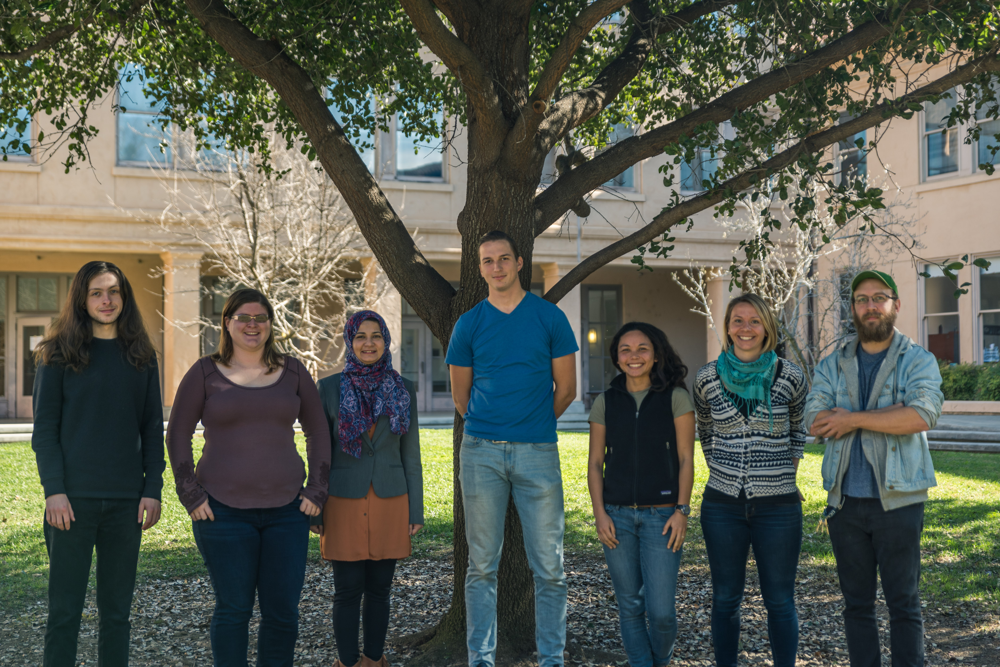
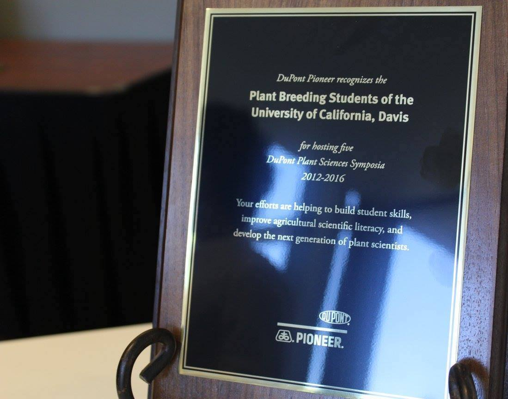

<head>
	<title>UCDPSS20</title>
</head>

<!-- Banner -->
<section id="banner" class="major">
	

		<header class="major">
			<h8>{{ page.landing-title }}</h8>
		</header>
		

			
{{ site.description }}

			<ul class="actions">
				<li><h2>May 6th, 2020</h2></li> 
				<li><a href="/register.html" class="button next scrolly">Registration</a></li>
			</ul>
		

		

            
{{ site.description }}

            <ul class="actions">
                    <li><a href="https://www.youtube.com/watch?v=IGRNBy2ZT6Y" class="button next scrolly">Watch pt.1 LIVE</a></li>
                </ul>
        

        

        
{{ site.description }}

        <ul class="actions">
        <li><a href="https://www.youtube.com/watch?v=tLDrvk4QsG0" class="button next scrolly">Watch pt.2 LIVE</a></li>
        </ul>
        

	

</section>

<!-- Main -->

<!-- One -->
<section id="one" class="tiles">

<article>

<header class="major">
<h3><a href="/register.html" class="link">Register</a></h3>

</header>
</article>

<article>

<header class="major">
<h3><a href="/speakers.html" class="link">Speakers</a></h3>

</header>
</article>

<article>

<header class="major">
<h3><a href="/program.html" class="link">Program</a></h3>

</header>
</article>

<article>

<header class="major">
<h3><a href="/organizers.html" class="link">Organizers</a></h3>

</header>
</article>

<article>

<header class="major">
<h3><a href="/abstracts.html" class="link">Call for abstracts</a></h3>

</header>
</article>

<article>

<header class="major">
<h3><a href="/symposia.html" class="link">Symposia Series</a></h3>

</header>
</article>

<article>

<header class="major">
<h3><a href="/sponsors.html" class="link">Sponsors & Opportunities</a></h3>

</header>
</article>

</section>

