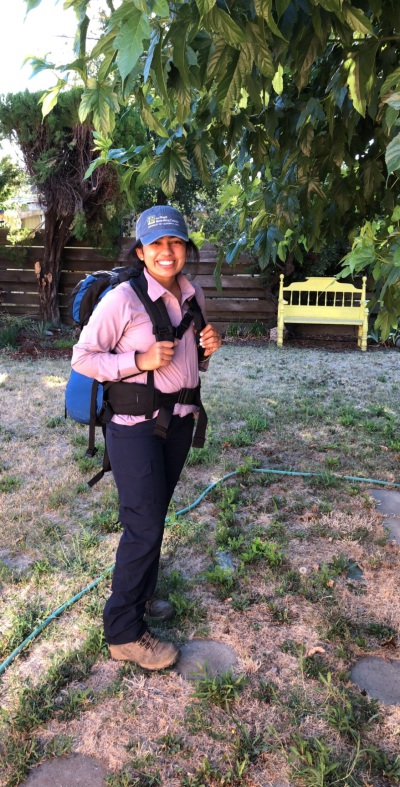
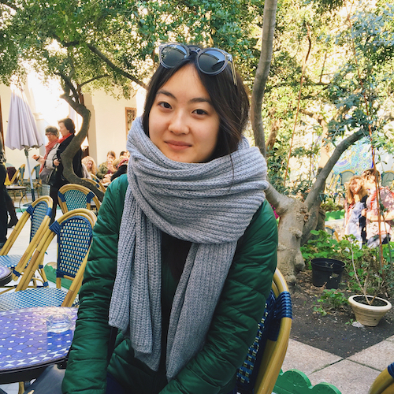
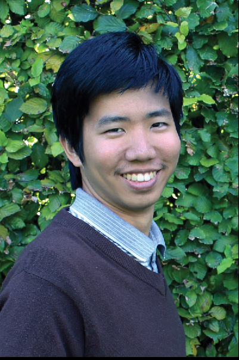
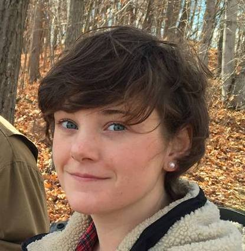

<!-- Banner -->
<!-- Note: The "styleN" class below should match that of the header element. -->
<section id="banner" class="style2">
	

		
			
		
		<header class="major">
			<h1>Organizers</h1>
		</header>
		

			
{{ page.description }}

		

	

</section>

<!-- Main -->

<!-- One -->
<section id="one">
	

	

</section>

<!-- Two -->
<section id="two" class="spotlights">
	<section>
			
		

			

				<header class="major">
					<h3 style="color: #C99700;">Amanjot Kaur</h3>
                     akskaur [at] ucdavis [dot] edu
				</header>
				
 Amanjot Kaur ("Jot") is a Master's student in Horticulture and Agronomy working on an interdisciplinary project between Plant Breeding and Genetics under Dr. Dina St. Clair and Biological and Agricultural Engineering under Dr. Irwin Donis-Gonzalez. Her graduate work focuses on high-throughput phenotyping of physiochemical traits in vegetables using spectroscopy-based engineering technologies. In addition to her thesis research, she is also working as a crop lead with the SCOPE (Student Collaborative Organic Plant Breeding and Education) project to breed heirloom-type tomato varieties for organic farming systems for fruit quality traits and plant architecture parameters. She received her B.S. degree in Biotechnology with an emphasis in plants from UC Davis in 2016. Amanjot’s hobbies include meditating and eating food!
                

			

		

	</section>

	<section>
			
		

			

				<header class="major">
                    <h3 style="color: #002855;">L. Anita To</h3>
                     lato [at] ucdavis [dot] edu
				</header>
				
Anita To is a Ph.D. Candidate in the Integrative Genetics and Genomics Graduate Group and an affiliate of the Center for Population Biology working with Dr. Charles Langley in the Department of Evolution and Ecology. Her current work focuses on the population genetics and genomics of North American conifer species at the intersection of theory and empiricism. She previously received her B.A. in Biological Sciences and Visual Arts from the University of Chicago.
			

			

		

	</section>

	<section>
			
		

			

				<header class="major">
					<h3 style="color: #C99700;">Asher Hudson</h3>
                     aihudson [at] ucdavis [dot] edu
				</header>
				
Asher Hudson is a Population Biology PhD student in Jeff Ross-Ibarra's lab. He studies local adaptation and stress resistance in maize and its wild ancestor teosinte using experimental and population genetic methods. He previously received a B.A. in Biology at the University of Chicago.
				

			

		

	</section>

	<section>
			
		

			

				<header class="major">
					<h3 style="color: #002855;">Saarah Kuzay</h3>
                     snkuzay [at] ucdavis [dot] edu
				</header>
                
Saarah Kuzay is a PhD student under Prof. Jorge Dubcovsky in the Horticulture and Agronomy Graduate Group. Her thesis work is focused on understanding the genetic basis of the number of spikelets per spike (SPS) in wheat, a yield component trait for pasta and bread wheat. She is using positional cloning to dissect the quantitative trait loci for number of spikelets per spike (SPS) located on chromosome arm 7AL (160-165 Mb). Ultimately, Saarah hopes to isolate this gene for SPS and deploy it in the UC Davis and CYMMIT wheat breeding programs. Outside of her thesis research, she is also working with SCOPE (Student Collaborative Organic Plant-Breeding and Education) to breed jalapeño and bell peppers for organic farming systems under Allen Van Deynze and Charles Brummer.
                

			

		

	</section>

		<section>
			
		

			

				<header class="major">
					<h3 style="color: #C99700;">Paul Kasemsap</h3>
					 pkasemsap [at] ucdavis [dot] edu
				</header>
				
A plant enthusiast, Pornpipat “Paul” Kasemsap is a PhD Candidate in Horticulture and Agronomy. In Arnold Bloom’s lab at UC Davis, Paul is collaborating with plant breeders, crop physiologists, and geneticists, on a quest to sustain wheat nutritional qualities under rising carbon dioxide environments anticipated in the near future. Paul completed a BS degree in Agricultural sciences at Kasetsart University, Thailand, and a MS degree in Plant Sciences (Greenhouse Horticulture) at Wageningen University, the Netherlands. Previously volunteering in the past years, Paul is excited to organize this wonderful symposium in 2019, and is looking forward great talks as well as fruitful discussions!
				

			

		

	</section>

	<section>
			
		

			

				<header class="major">
					<h3 style="color: #002855;">Sarah Odell</h3>
                    sgodell [at] ucdavis [dot] edu
				</header>
				
Odell is a 2nd year Plant Biology PhD student in the Runcie and Ross-Ibarra labs. She received a B.S. in Plant Science from Cornell University. She is generally interested in using quantitative and population genetics to answer questions about plasticity and the biology of stress tolerance.
				

			

		

	</section>

		<section>
			
		

			

				<header class="major">
					<h3 style="color: #C99700;">Jeffrey Ross-Ibarra</h3>
					rossibarra [at] ucdavis [dot] edu
				</header>
				
Dr. Jeff Ross-Ibarra is a Professor and Section Chair in the Department of Plant Sciences. He also holds affiliations with The Center for Population Biology and The Genome Center at UC Davis. His lab works on the evolutionary genetics of maize and teosinte. He has served as the faculty advisor to the UC Davis Plant Breeding Symposium since its inception 6 years ago.

			

		

	</section>
