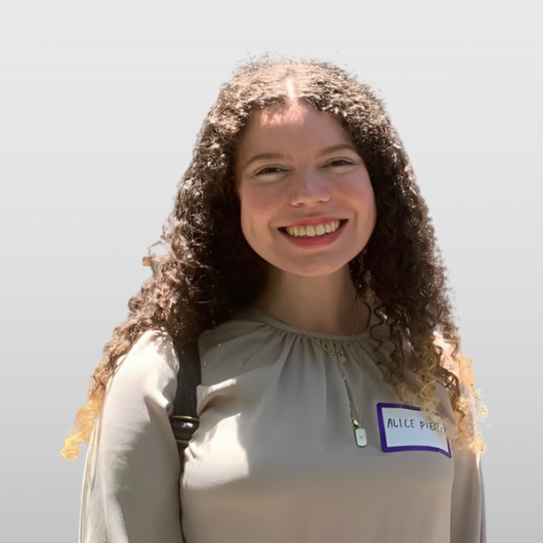
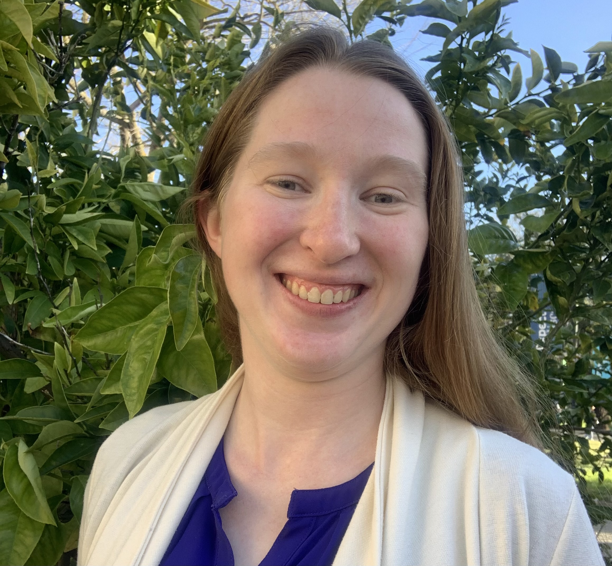

<html>
<head>
<meta name="viewport" content="width=device-width, initial-scale=1">

</head>
<body>

  

    

      
      

        <h3 style="color:#202520">Marie Klein</h3>
        
Horticulture and Agronomy, PhD Candidate

        
Gail Taylor Lab

      

    

  

  

    

      
      

        <h3 style="color:#202520">Sadikshya Sharma</h3>
        
Horticulture and Agronomy, PhD Candidate

        
Grape Breeding (Luis Diaz Garcia) Lab

      

    

  

  
  

    

      
      

        <h3 style="color:#202520">Matthew Davis</h3>
        
Plant Biology, PhD Student

        
Grey Monroe & Pat J Brown Labs

      

    

  

  

    

      
      

        <h3 style="color:#202520">Alice Pierce</h3>
        
Plant Biology, PhD Student

        
Grey Monroe Lab

      

    

  

  
   

    

      
      

        <h3 style="color:#202520">Colleen Mills</h3>
        
Ecology, PhD Student

        
Tom Buckley Lab

      

    

  

  
   

    

      
      

        <h3 style="color:#202520">Jadran Garcia</h3>
        
PhD Candidate

        
Dario Cantu Lab

      

    

  

  
  

    

      
      

        <h3 style="color:#202520">Grey Monroe</h3>
        
Dept. of Plant Sciences

        
Assistant Professor

      

    

  

</body>
</html>
