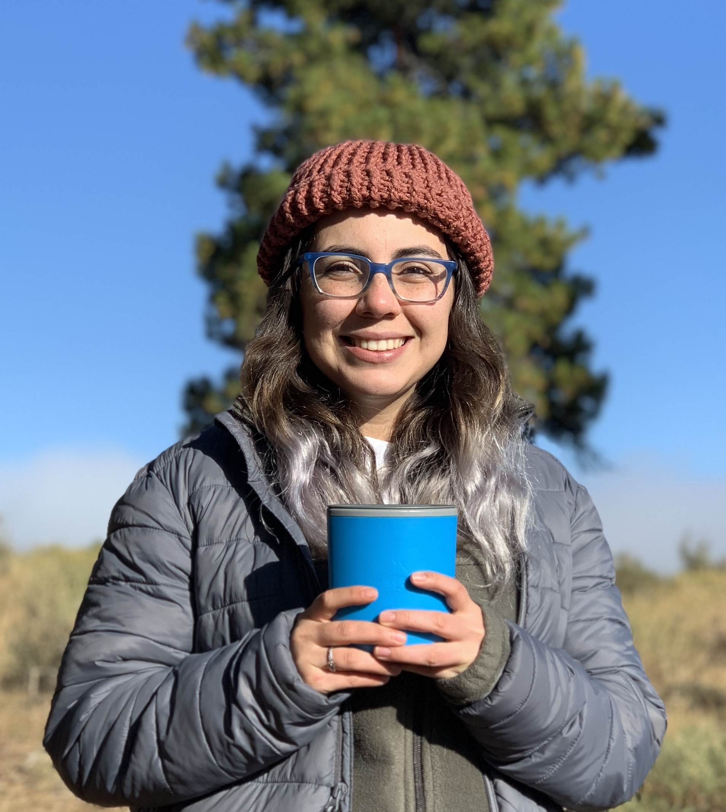
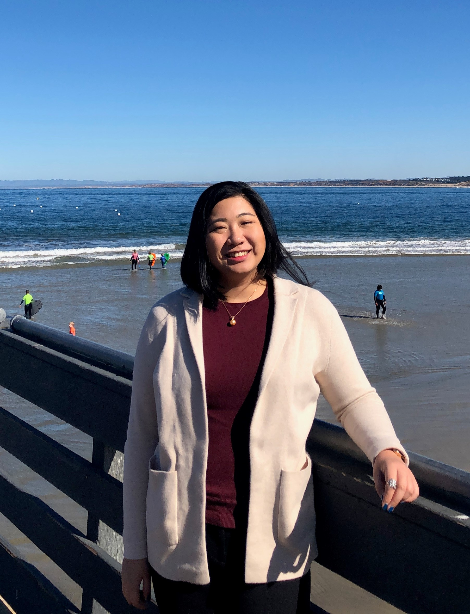

<!-- Banner -->
<!-- Note: The "styleN" class below should match that of the header element. -->
<section id="banner" class="style2">
	

		
			
		
		<header class="major">
			<h1>Organizers</h1>
		</header>
		

			
{{ page.description }}

		

	

</section>

<!-- Main -->

<!-- One -->
<section id="one">
	

	

</section>

<!-- Two -->
<section id="two" class="spotlights">
	<section>
			
		

			

				<header class="major">
					<h3 style="color: #C99700;">Alyssa Phillips</h3>
                     arphillips [at] ucdavis [dot] edu
				</header>
				
 Alyssa Phillips is a PhD student in the Plant Biology Graduate Group with Jeffrey Ross-Ibarra in the Department of Evolution and Ecology. Her current research focuses on local adaptation in the polyploid complex Andropogon gerardi (Poaceae) and convergent evolution between Tripsacum and teosinte. She previously received a B.S. in Biology from Appalachian State University.
                

			

		

	</section>

	<section>
			
		

			

				<header class="major">
                    <h3 style="color: #002855;">Amber Flores</h3>
                     amaflores [at] ucdavis [dot] edu
				</header>
				
Amber Flores is a 2nd year PhD student in the Plant Biology Graduate Group and a member of Dr. Richard Michelmore’s lab. Her current research project focuses on using gene editing techniques to enhance the nutritional content of lettuce, specifically increasing carotenoid and amino acid content. When not in lab, she enjoys spending quality time with her friends and family, playing softball, and promoting the curiosity of her two young kittens. 
			

			

		

	</section>

	<section>
			
		

			

				<header class="major">
					<h3 style="color: #002855;">Anna Cowie</h3>
                    aecowie [at] ucdavis [dot] edu
				</header>
				
Anna Cowie is a 2nd year PhD student in the Plant Biology Graduate Group (PBGG) and a member of Dr. Philipp Zerbe’s lab. Her current research project focuses on the biosynthesis, regulation, and catalytic mechanisms of diterpenoid-metabolic enzymes in maize. She received a B.S. in Biology at Westminster College, Pennsylvania. When not in lab, she enjoys collecting houseplants, painting, and spending quality time with her dog, who also shares a passion for science.
				

			

		

	</section>

	<section>
			
		

			

				<header class="major">
					<h3 style="color: #C99700;">Cody Bekkering</h3>
                     csbekkering [at] ucdavis [dot] edu
				</header>
				
Cody Bekkering is a second-year Ph.D. student in the Plant Biology Graduate Group (PBGG). Cody's current work focuses on the provitamin A biofortification of tetraploid wheat and the phenotypic repercussions that biofortification. He received a B.S. in plant biology and a B.A. in chemistry from Michigan State University before continuing his studies at UC Davis.
				

			

		

	</section>

	<section>
			
		

			

				<header class="major">
					<h3 style="color: #002855;">Hongtao Zhang</h3>
                     htzhang [at] ucdavis [dot] edu
				</header>
                
Hongtao Zhang is a 2nd year PhD student under Dr. Stacey Harmer in the Plant Biology Graduate Group. He is generally interested in plants’ responses to various environmental factors. Currently he works on the regulation of Arabidopsis circadian clock at transcriptional and post-transcriptional levels using genetic and molecular approaches. Hongtao received his BS degree in Biological Science from Peking University, China.
                

			

		

	</section>

		<section>
			
		

			

				<header class="major">
					<h3 style="color: #C99700;">Kreingkrai Nonkum</h3>
					 knonkum [at] ucdavis [dot] edu
				</header>
				
A  Kreingkrai “Moo” Nonkum is a 2nd year PhD student in Horticulture and Agronomy. In Charlie Brummer’s lab at UC Davis, Moo's research focuses on understanding fall dormancy in affalfa to help alfalfa breeder indentify fall dormancy trait more precisely. Moo completed a BS degree in Agricultural sciences and MS degree in Agronomy at Kasetsart University, Thailand.
				

			

		

	</section>

	<section>
			
		

			

				<header class="major">
					<h3 style="color: #002855;">Yufei Qian</h3>
                    yfqian [at] ucdavis [dot] edu
				</header>
				
Yufei Qian is a second year M.S/PhD student in the Horticulture & Agronomy program (GGHA) and a member of Dr. Gail Taylor's lab at UC Davis. Her current research interests are focused on the specialty crop watercress and aiming to increase the metabolomics nutrient contents which provide important health benefits through consumption of this leafy Brassicaceae vegetable. Yufei attained her B.S. from UC Davis in Environmental Horticulture with a specialization in Floriculture.
				

			

		

	</section>
	

		<section>
			
		

			

				<header class="major">
					<h3 style="color: #C99700;">Jeffrey Ross-Ibarra</h3>
					rossibarra [at] ucdavis [dot] edu
				</header>
				
Dr. Jeff Ross-Ibarra is a Professor and Section Chair in the Department of Plant Sciences. He also holds affiliations with The Center for Population Biology and The Genome Center at UC Davis. His lab works on the evolutionary genetics of maize and teosinte. He has served as the faculty advisor to the UC Davis Plant Science Symposium since its inception.

			

		

	</section>
