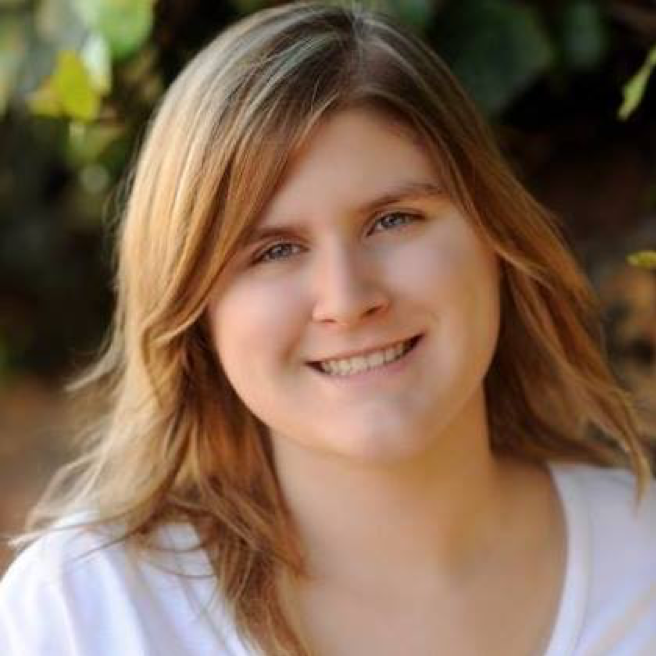
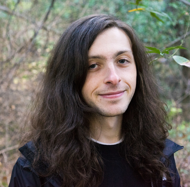
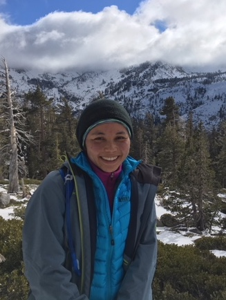
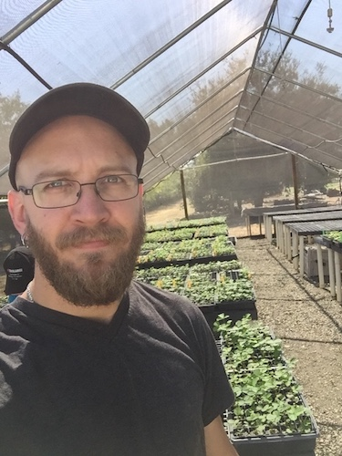
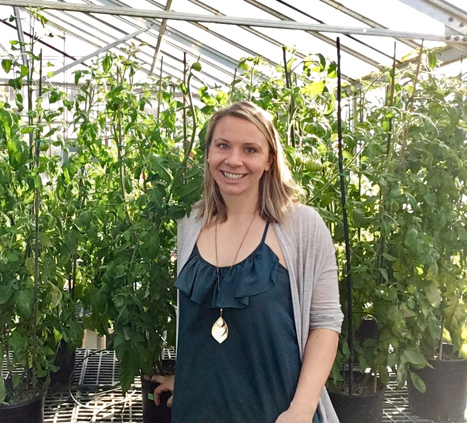

<!-- Banner -->
<!-- Note: The "styleN" class below should match that of the header element. -->
<section id="banner" class="style2">
	

		
			
		
		<header class="major">
			<h1>Organizers</h1>
		</header>
		

			
{{ page.description }}

		

	

</section>

<!-- Main -->

<!-- One -->
<section id="one">
	

	

</section>

<!-- Two -->
<section id="two" class="spotlights">
	<section>
			
		

			

				<header class="major">
					<h3 style="color: #C99700;">Scott Newell</h3> 
                     sanewell [at] ucdavis [dot] edu
				</header>
				
Scott Newell is a Masters student in Horticulture and Agronomy studying plant breeding and genetics. His research work in Dr. E. Charles Brummer's lab involves assessing the potential application of genetic fingerprinting to alfalfa varieties, as well as the evaluation of new germplasm for introgression into a developing UC Davis alfalfa breeding program. Scott completed his B.S. in Agronomy with an emphasis on plant breeding at Iowa State University and found an interest in plant breeding and bioinformatics.
                

			

		

	</section>

	<section>
			
		

			

				<header class="major">
                    <h3 style="color: #002855;">Dominique Pincot</h3>
                     ddpincot [at] ucdavis [dot] edu 
				</header>
				
Dominique Pincot is a first-year PhD student in Horticulture and Agronomy studying plant breeding and genetics. She received a BS in Biology from Tufts University in Medford, Massachusetts, and a MS degree in Horticulture and Agronomy from the University of California, Davis. Her research with Dr. Steven Knapp's lab focuses on characterizing resistance to Fusarium wilt and Verticillium wilt in cultivated strawberry (Fragaria x ananassa.)
			

			

		

	</section>

	<section>
			
		

			

				<header class="major">
					<h3 style="color: #C99700;">Asher Hudson</h3>
                     aihudson [at] ucdavis [dot] edu 
				</header>
				
Asher Hudson is a Population Biology PhD student in Jeff Ross-Ibarra's lab. He studies local adaptation and stress resistance in maize and its wild ancestor teosinte using experimental and population genetic methods. He previously received a B.A. in Biology at the University of Chicago.
				

			

		

	</section>

	<section>
			
		

			

				<header class="major">
					<h3 style="color: #002855;">Saarah Kuzay</h3>
                     snkuzay [at] ucdavis [dot] edu 
				</header>
                
Saarah Kuzay is a PhD student under Prof. Jorge Dubcovsky in the Horticulture and Agronomy Graduate Group. Her thesis work is focused on understanding the genetic basis of the number of spikelets per spike (SPS) in wheat, a yield component trait for pasta and bread wheat. She is using positional cloning to dissect the quantitative trait loci for number of spikelets per spike (SPS) located on chromosome arm 7AL (160-165 Mb). Ultimately, Saarah hopes to isolate this gene for SPS and deploy it in the UC Davis and CYMMIT wheat breeding programs. Outside of her thesis research, she is also working with SCOPE (Student Collaborative Organic Plant-Breeding and Education) to breed jalapeño and bell peppers for organic farming systems under Allen Van Deynze and Charles Brummer.
                

			

		

	</section>
	
		<section>
			
		

			

				<header class="major">
					<h3 style="color: #C99700;">Mitchell Feldmann</h3>
					 mjfeldmann [at] ucdavis [dot] edu 
				</header>
				
Mitchell Feldmann is a 3rd year doctoral student of horticulture and agronomy in the Strawberry Breeding and Research program at UC Davis. He completed his BS in Ecology and Evolutionary Biology with a minor in mathematics at the University of Arizona under Dr. Noah Whiteman, where he discovered a passion for biological research. Mitchell's scientific interests include quantitative and evolutionary genetics relating to plant breeding and crop improvement. His current work includes the evaluation of heterosis, theoretical evaluations of QTL heritability estimates, and genomic selection application in the cultivated strawberry.
				

			

		

	</section>

	<section>
			
		

			

				<header class="major">
					<h3 style="color: #002855;">Laila Fayyaz</h3>
                    lfayyaz [at] ucdavis [dot] edu
				</header>
				
Laila Fayyaz is a Ph.D. candidate in the Graduate Group of Horticulture and Agronomy. She works in the Department of Viticulture and Enology at the University of California, Davis. She is working with Dr. Andrew Walker in his grapevine breeding research program. She completed her master's and bachelor's degrees in Plant Breeding and Genetics at the University of Agriculture Peshawar-Pakistan. Although she is currently working with grapevines, she has extensive experience with other crops as well. Her undergraduate research focused on phenotyping wild accessions of rice. For her master's project, she worked on oliferous species of Brassica. She has now moved on to grapes, one of the most popular fruit crops in the world. Her current project focuses on map-based cloning of genes for powdery mildew resistance from the Chinese grape species <i>Viti piasezkii</i>. Her goal is to understand the genetic relationship between the host plant, grapevines and the pathogen, <i>E. necator</i> and ultimately understand the mechanism of grapevine defense against the powdery mildew disease caused by <i>E. necator</i>.
				

			

		

	</section>
	
		<section>
			
		

			

				<header class="major">
					<h3 style="color: #C99700;">Stephanie Smolenski Zullo</h3>
                    sszulo [at] ucdavis [dot] edu
				</header>
				
Stephanie Smolenski Zullo is a Ph.D. student in the Horticulture & Agronomy Graduate Group studying plant breeding and genetics in Paul Gepts lab.  She received her B.S. in Biological Sciences from Cornell University and her M.S. in Crop Sciences with a concentration in Plant Breeding from the University of Illinois.  Stephanie has previously worked on commercial plant breeding projects in maize, sunflower and tomato.  Her graduate research is focused on identifying the underlying biochemical mechanisms and genetics of biotic stress resistance in lima bean.
				

			

		

	</section>

		<section>
			
		

			

				<header class="major">
					<h3 style="color: #C99700;">Jeffrey Ross-Ibarra</h3>
					rossibarra [at] ucdavis [dot] edu 
				</header>
				
Dr. Jeff Ross-Ibarra is a Professor and Section Chair in the Department of Plant Sciences. He also holds affiliations with The Center for Population Biology and The Genome Center at UC Davis. His lab works on the evolutionary genetics of maize and teosinte. He has served as the faculty advisor to the UC Davis Plant Breeding Symposium since its inception 6 years ago.

			

		

	</section>
