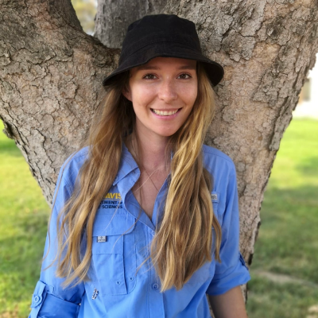
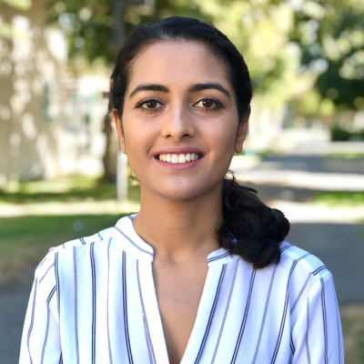
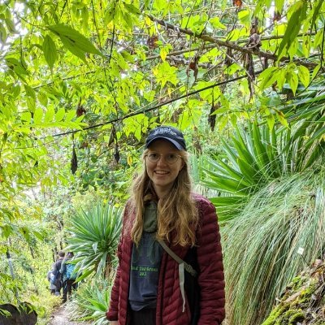
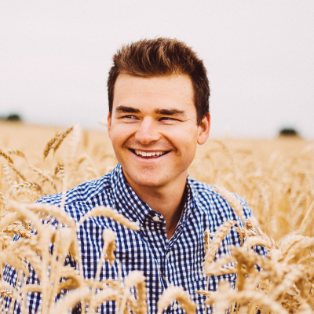

<html>
<head>
<meta name="viewport" content="width=device-width, initial-scale=1">

</head>
<body>

  

    

      
      

        <h2>Marie Klein</h2>
        
Horticulture and Agronomy

        
Gail Taylor Lab

      

    

  

  

    

      
      

        <h2>Sadikshya Sharma</h2>
        
Horticulture and Agronomy

        
Strawberry Breeding Lab

      

    

  

  
  

    

      
      

        <h2>Dante Leventini</h2>
        
Horticulture and Agronomy

        
Patrick H. Brown Lab

      

    

  

  
  

    

      
      

        <h2>Mary-Francis LaPorte</h2>
        
Plant Biology

        
Christine Diepenbrock Lab

      

    

  

  
  

    

      
      

        <h2>Katie Simpson-Johnson</h2>
        
Soils and Biogeochemistry

        
Amelie Gaudin Lab

      

    

  

  
  

    

      
      

        <h2>Matthew Davis</h2>
        
Plant Biology

        
Rotating

      

    

  

  

    

      
      

        <h2>Kyle Rizzo</h2>
        
Horticulture and Agronomy

        
Brian Bailey Lab

      

    

  

  
  

    

      
      

        <h2>Grey Monroe</h2>
        
Assistant Professor

        
Dept. of Plant Sciences

      

    

  

</body>
</html>