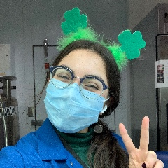
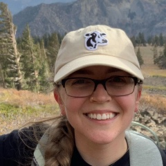
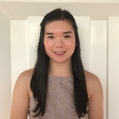

<!-- Banner -->
<!-- Note: The "styleN" class below should match that of the header element. -->
<section id="banner" class="style2">
	

		
			
		
		<header class="major">
			<h1>Organizers</h1>
		</header>
		

			
{{ page.description }}

		

	

</section>

<!-- Main -->

<!-- One -->
<section id="one">
	

	

</section>

<!-- Two -->
<section id="two" class="spotlights">
	<section>
			
		

			

				<header class="major">
					<h3 style="color: #C99700;">Amanda Agosto Ramos</h3>
                     aagostoramos [at] ucdavis [dot] edu
				</header>
				
 Amanda is a PhD student in the Plant Biology Graduate Group with Daniel Kliebenstein in the Department of Plant Sciences. 
                

			

		

	</section>

	<section>
			
		

			

				<header class="major">
                    <h3 style="color: #002855;">Amber Flores</h3>
                     amaflores [at] ucdavis [dot] edu
				</header>
				
Amber Flores is a 2nd year PhD student in the Plant Biology Graduate Group and a member of Dr. Richard Michelmore’s lab. Her current research project focuses on using gene editing techniques to enhance the nutritional content of lettuce, specifically increasing carotenoid and amino acid content. When not in lab, she enjoys spending quality time with her friends and family, playing softball, and promoting the curiosity of her two young kittens. 
			

			

		

	</section>

	<section>
			
		

			

				<header class="major">
					<h3 style="color: #002855;">Elli Cryan</h3>
                    epcryan [at] ucdavis [dot] edu
				</header>
				
Elli Cryan is a Plant Biology PhD candidate with a B.S. in Mathematical Biology from William & Mary. Elli is developing a network model of complex trait evolution to study the convergence of C4 photosynthesis across the plant tree of life. She is advised by Dan Kliebenstein and Jeff Ross-Ibarra. 
				

			

		

	</section>

	<section>
			
		

			

				<header class="major">
					<h3 style="color: #C99700;">Natalie Hamada</h3>
                     nhamada [at] ucdavis [dot] edu
				</header>
				
Natalie is a 2nd-year PhD student in the Plant Biology Graduate Group, working in Nitzan Shabek’s lab. Her current research focuses revolve around characterizing the role of the Ubiquitin Proteasome System in plant immunity, with a particular interest in studying the mechanisms behind plant immune receptor homeostasis. When not in lab she enjoys working out, video games, and spending time with her cat.
				

			

		

	</section>	

		<section>
			
		

			

				<header class="major">
					<h3 style="color: #C99700;">Jeffrey Ross-Ibarra</h3>
					rossibarra [at] ucdavis [dot] edu
				</header>
				
Dr. Jeff Ross-Ibarra is a Professor in the Department of Evolution and Ecology. He also holds affiliations with The Center for Population Biology and The Genome Center at UC Davis. His lab works on the evolutionary genetics of maize and teosinte. He has served as the faculty advisor to the UC Davis Plant Science Symposium since its inception.

			

		

	</section>
