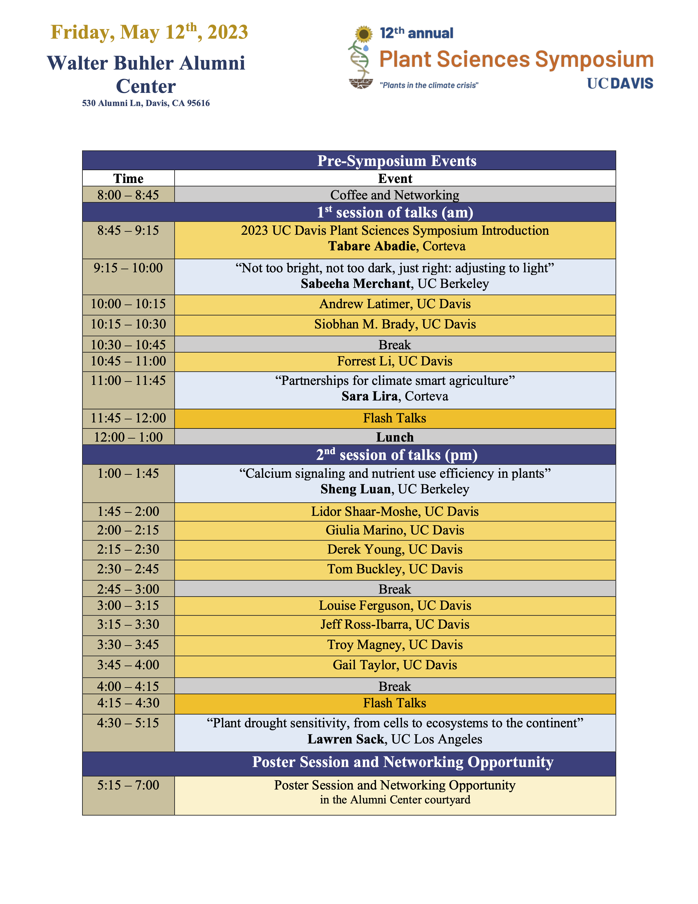

<!---
[Symposium schedule4.pdf](https://github.com/pbgso/pbgso.github.io/files/8713394/Symposium.schedule4.pdf)

|     Time                                                             |     Event                                                              |
|----------------------------------------------------------------------|------------------------------------------------------------------------|
|     8:30 – 8:45                                                      |     Coffee and Networking                                              |
|                    Introduction and Plenary Speaker                  |                                                                        |
|     8:45 – 9:00                                                      |     2022 UC Davis Plant Sciences Symposium Opening – Jason Rauscher    |
|     9:00 – 9:45                                                      |     Awais Kahn, Cornell University                                     |
|     9:45 – 10:00                                                     |     Break                                                              |
|                   Student and Postdoctoral Speakers                  |                                                                        |
|     10:00 – 10:15                                                    |     Jie Zhu, UC Davis Graduate Student                                 |
|     10:15 – 10:30                                                    |     Jennifer Cribbs, UC Davis Graduate Student                         |
|     10:30 – 10:45                                                    |     Amy Groh, UC Davis Graduate   Student                              |
|     10:45 – 11:00                                                    |     Mukund Rao, UC Davis Postdoc                                       |
|     11:00 – 11:15                                                    |     Break                                                              |
|               Flashtalks and Corteva Featured Speaker                |                                                                        |
|     11:15 – 11:20                                                    |     Anna Jo Muhich, UC Davis   Graduate Student                        |
|     11:20 – 11:25                                                    |     Tayab Soomro, Dalhousie University Graduate Student                |
|     11:25 – 11:30                                                    |     Priscilla Glenn, UC Davis   Graduate Student                       |
|     11:30 – 12:00                                                    |     Kyle Cheung, Corteva                                               |
|     12:00 – 1:00                                                     |     Lunch                                                              |
|              Plenary, Student, and Postdoctoral Speakers             |                                                                        |
|     1:00 – 1:45                                                      |     Gerald Tusken, Oakridge   National Laboratory                      |
|     1:45 – 2:00                                                      |     Zach Liechty, UC Davis   Postdoctoral Researcher                   |
|     2:00 – 2:15                                                      |     Dorota Kawa, UC Davis   Postdoctoral Researcher                    |
|     2:15 – 2:30                                                      |     Paul Kasemsap, UC Davis Graduate   Student                         |
|     2:30 – 2:45                                                      |     Break                                                              |
|       Student, Postdoctoral Speakers, and Video Flashtalks           |                                                                        |
|     2:45 – 3:00                                                      |     Mitchell Feldmann, UC Davis   Postdoctoral Researcher              |
|     3:00 – 3:15                                                      |     Tianrun Li, UC Davis    Graduate Student                           |
|     3:15 – 3:30                                                      |     Kimberly Gibson, UC Davis  Graduate Student                        |
|     3:30 – 3:40                                                      |     Break                                                              |
|     3:40 – 3:45                                                      |     Yufei Qian, UC Davis Graduate   Student                            |
|     3:45 – 3:50                                                      |     Sandeep Chapagain, LSU Graduate   Student                          |
|     3:50 – 3:55                                                      |     Swati Shrestha, UF Graduate   Student                              |
|     3:55 – 4:00                                                      |     Micah Levinson,     UC Davis Assistant Specialist                  |
|     4:00 – 4:15                                                      |     Break                                                              |
|                            Plenary Speaker                           |                                                                        |
|     4:15 – 5:00                                                      |     Neelima Sinha, UC Davis                                            |
|          Poster Session and Networking (In Person and Virtual)       |                                                                        |
|     5:00 – 7:00                                                      |     Poster Session and Networking   Opportunity                        |

-->
