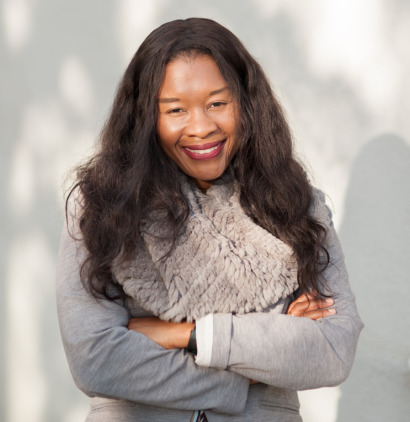

<!-- Banner -->
<!-- Note: The "styleN" class below should match that of the header element. -->
<section id="banner" class="style2">
	

		
			
		
		<header class="major">
			<h1>Speakers</h1>
		</header>
		

			
{{ page.description }}

		

	

</section>

<!-- Main -->

<!-- One -->
<section id="one">
	

		<header class="major">
        <h1 style="color:#ffffff;"> Keynote Speakers</h1>
		</header>
	

</section>

<!-- Two -->

<section id="two" class="spotlights">

	<section>
            
		

			

				<header class="major">
					<h3>Robin Hopkins</h3>
                    
				</header>
				
Dr. Robin Hopkins is an Assistant Professor in the Department of Organismic and Evolutionary Biology at Harvard University. She received her PhD from Duke University where she studied the genetics, ecology, and evolution of speciation in plants.  Prior to starting her lab at the Arnold Arboretum of Harvard University, she was awarded a National Science Foundation Postdoctoral Research Fellowship in Biology to use mathematical models to investigate the role of natural selection in speciation. Her research characterizes and quantifies the forces of selection, gene flow, and mutation during the process of speciation. She integrates genetic, genomic, and field bases research to understand the ecological and evolutionary consequences of hybridization, and how closely related plant lineages have evolved barriers to prevent reproducing.
				

			

		

	</section>

	<section>
			
		

			

				<header class="major">
					<h3>José Dinneny</h3>
                    
				</header>
				
 José Dinneny received his BS from UC Berkeley in Plant Biology and Genetics in the Department of Plant and Microbial Biology and PhD from UC San Diego working with Detlef Weigel at the Salk Institute for Biological Science and Martin Yanofsky in the Division of Biology, UCSD. His work focused on the cloning and characterization of JAGGED and NUBBIN in flower and fruit development. He then went to Duke University to do his post-doctoral studies with Philip Benfey. There he utilized Fluorescence Activated Cell Sorting (FACS) to develop the first tissue-specific map of transcriptional changes occurring during abiotic stress. José established his independent lab at the Temasek Lifesciences Laboratory (TLL) in Singapore. He moved his lab in 2011 to the Carnegie Institution for Science, Department of Plant Biology. In 2018 José joined the faculty at Stanford University in the Biology Department as an Associate Professor.
				

			

		

	</section>

    <section>
            
        

            

                <header class="major">
                    <h3>Michael Gore</h3>
                    
                </header>
                
 Michael Gore is an associate professor of molecular breeding and genetics for nutritional quality, Liberty Hyde Bailey professor, and international professor of plant breeding and genetics at Cornell University, where he is a member of the faculty in the Plant Breeding and Genetics Section in the School of Integrative Plant Science. He holds a BS and MS from Virginia Tech, and a PhD from Cornell University. His expertise is in the field of quantitative genetics and genomics, especially the genetic dissection of metabolic seed traits related to nutritional quality. He also develops and applies field-based, high-throughput phenotyping tools for plant breeding and genetics research. His career accomplishments in plant breeding and genetics earned him the National Association of Plant Breeders Early Career Scientist Award in 2012, the American Society of Plant Biologists Early Career Award in 2013, and the Maize Genetics Executive Committee Early Career Excellence in Maize Genetics Award in 2016.

                

            

        

    </section>

    <section>
            
        

            

                <header class="major">
                    <h3>Sue Rhee</h3>
                    
                </header>
                    
 Bio to come
                    

            

        

    </section>

    <section>
            
        

            

                <header class="major">
                    <h3>TBD</h3>
                    
                    </header>
                    
 Bio TK
                    

            

        

    </section>

    <section>
        
            

                

                    <header class="major">
                    <h3>TBD</h3>
                    
                    </header>
                    
 Bio TK
                    

                

            

    </section>

</section>

<!-- Three -->
<section id="three" style="background-color:#c99700;>
	

		<header class="major">
        <h1 style="color:#ffffff;"> UC Davis Spotlight</h1>
		</header>
	

</section>

<!-- Four -->

<section id="four" class="spotlights">

	<section>
            
		

			

				<header class="major">
					<h3>Diane M. Beckles</h3>
                    
				</header>
				
 Diane M Beckles is an Associate Professor and Associate Postharvest Biochemist in the Department of Plant Sciences at the University of California, Davis. Dr. Beckles’ research is focused on identifying genes and environmental factors that determine the postharvest quality of horticultural crops and cereals. Her primary interests are in starch biosynthesis and structure, and the postharvest chilling injury of horticultural crops. Her lab aims to understand the molecular basis of quality components in fruit, vegetable and cereals in order to optimize value for the consumer, thereby reducing food waste and lost. Her expertise ranges from molecular physiology to the structural and chemical analysis of biomaterials. Dr. Beckles received her Bachelor’s degree in Biotechnology from University of Sheffield, (UK), and her PhD. from the University of Cambridge (UK), with postdoctoral research at DuPont Agricultural Biotechnology (USA). She is a member of the American Society of Horticultural Science, and the International Society of Horticultural Science.

				

			

		

	</section>

	<section>
			
		

			

				<header class="major">
					<h3>Mohsen Mesgaran</h3>
                    
				</header>
				
 Bio TK
				

			

		

	</section>

    <section>
            
        

            

                <header class="major">
                    <h3>Amélie Gaudin</h3>
                    
                </header>
                
Bio TK
                

            

        

    </section>

    <section>
            
        

            

                <header class="major">
                    <h3>Abraham Morales-Cruz</h3>
                    
                </header>
                    
Bio TK
                    

            

        

    </section>
</section>

