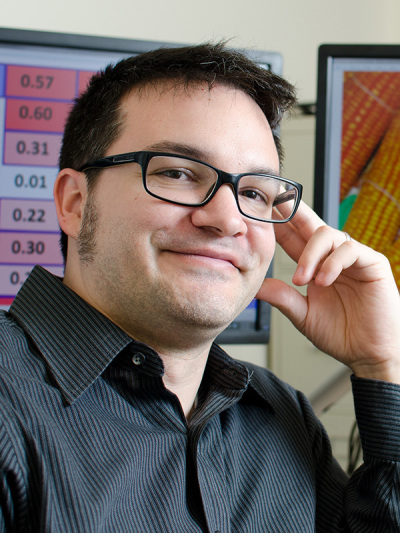
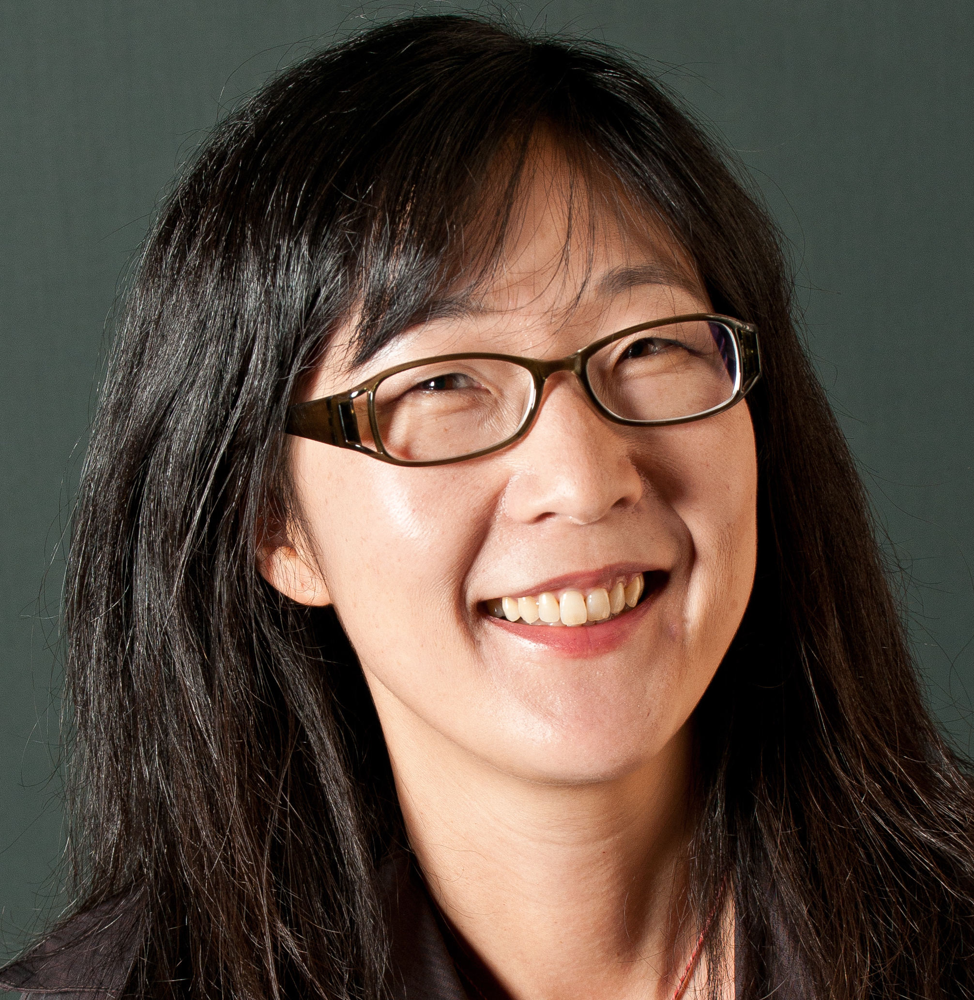
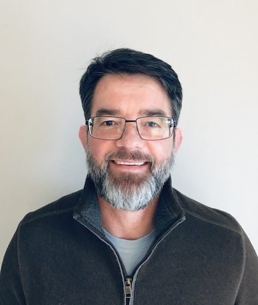
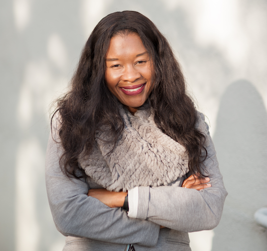
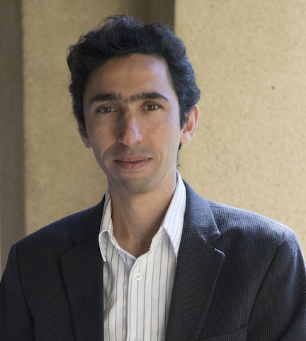
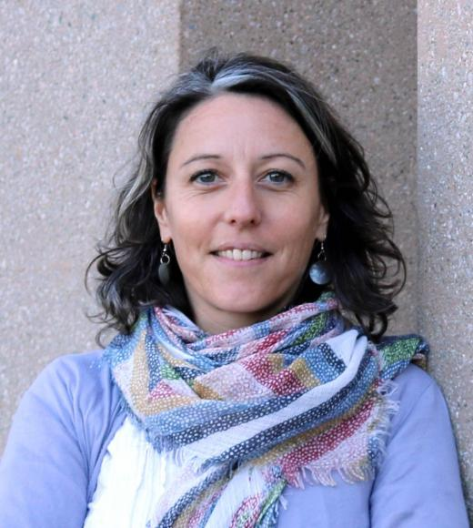
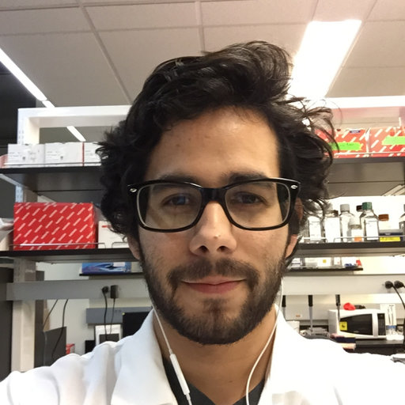

<!-- Banner -->
<!-- Note: The "styleN" class below should match that of the header element. -->
<section id="banner" class="style2">
	

		
			
		
		<header class="major">
			<h1>Speakers</h1>
		</header>
		

			
{{ page.description }}

		

	

</section>

<!-- Main -->

<!-- One -->
<section id="one">
	

		<header class="major">
        <h1 style="color:#ffffff;"> Keynote Speakers</h1>
		</header>
	

</section>

<!-- Two -->

<section id="two" class="spotlights">
	<section>
            
		

			

				<header class="major">
					<h3>Robin Hopkins</h3>
                    
				</header>
				
Dr. Robin Hopkins is an Assistant Professor in the Department of Organismic and Evolutionary Biology at Harvard University. She received her PhD from Duke University where she studied the genetics, ecology, and evolution of speciation in plants.  Prior to starting her lab at the Arnold Arboretum of Harvard University, she was awarded a National Science Foundation Postdoctoral Research Fellowship in Biology to use mathematical models to investigate the role of natural selection in speciation. Her research characterizes and quantifies the forces of selection, gene flow, and mutation during the process of speciation. She integrates genetic, genomic, and field based research to understand the ecological and evolutionary consequences of hybridization, and how closely related plant lineages have evolved barriers to prevent reproducing.
				

			

		

	</section>

	<section>
			
		

			

				<header class="major">
					<h3>José Dinneny</h3>
                    
				</header>
				
 José Dinneny received his BS from UC Berkeley in Plant Biology and Genetics in the Department of Plant and Microbial Biology and PhD from UC San Diego working with Detlef Weigel at the Salk Institute for Biological Science and Martin Yanofsky in the Division of Biology, UCSD. His work focused on the cloning and characterization of JAGGED and NUBBIN in flower and fruit development. He then went to Duke University to do his post-doctoral studies with Philip Benfey. There he utilized Fluorescence Activated Cell Sorting (FACS) to develop the first tissue-specific map of transcriptional changes occurring during abiotic stress. José established his independent lab at the Temasek Lifesciences Laboratory (TLL) in Singapore. He moved his lab in 2011 to the Carnegie Institution for Science, Department of Plant Biology. In 2018 José joined the faculty at Stanford University in the Biology Department as an Associate Professor.
				

			

		

	</section>

    <section>
            
        

            

                <header class="major">
                    <h3>Michael Gore</h3>
                    
                </header>
                
 Michael Gore is an associate professor of molecular breeding and genetics for nutritional quality, Liberty Hyde Bailey professor, and international professor of plant breeding and genetics at Cornell University, where he is a member of the faculty in the Plant Breeding and Genetics Section in the School of Integrative Plant Science. He holds a BS and MS from Virginia Tech, and a PhD from Cornell University. His expertise is in the field of quantitative genetics and genomics, especially the genetic dissection of metabolic seed traits related to nutritional quality. He also develops and applies field-based, high-throughput phenotyping tools for plant breeding and genetics research. His career accomplishments in plant breeding and genetics earned him the National Association of Plant Breeders Early Career Scientist Award in 2012, the American Society of Plant Biologists Early Career Award in 2013, and the Maize Genetics Executive Committee Early Career Excellence in Maize Genetics Award in 2016.
                

            

        

    </section>

    <section>
            
        

            

                <header class="major">
                    <h3>Sue Rhee</h3>
                    
                </header>
                    
 Seung Yon (Sue) Rhee is a Senior Staff Member of Plant Biology Department at Carnegie Institution for Science. Her group strives to uncover the molecular mechanisms underlying adaptive traits in the face of heat, drought, nutrient limitation, latitude and pests. Dr. Rhee’s group studies a variety of plants including models, orphan crops, medicinal and desert plants. More recently their work has involved studying a model nematode C. elegans, fungal pathogens, corals, and piezophilic bacterium. Her group employs computational modeling and targeted laboratory testing to study mechanisms of adaptation, functions of novel genes, organization and function of metabolic networks, and chemical and neuronal code of plant-animal interactions. Her group is also interested in developing translational research programs involving carbon sequestration by plants and biomass maximization under drought in bioenergy crops. Dr. Rhee received her B.A. in biology from Swarthmore College and a Ph.D. in biology from Stanford University. She has been an investigator at the Plant Biology Department of Carnegie Institution for Science since 1999.
                    

            

        

    </section>

		<section>
            
        

            

                <header class="major">
                    <h3>Radu Totir</h3>
                    
                </header>
                    
 Radu Totir has received his undergraduate degree in Animal Science from Universitatea de Stiinte Agricole si Medicina Veterinara, Cluj-Napoca, Romania followed by a PhD in Animal Breeding and Genetics from Iowa State University (ISU). After two years as a postdoctoral research fellow in the Animal Breeding and Genetics group at ISU, Radu has joined DuPont Pioneer on October 01, 2004. He is currently Biostatistics Lead in Systems and Innovations for Breeding and Seed Products at Corteva™ Agriscience, Agriculture Division of DowDuPont™. In his role, Radu is responsible for global teams focused on high throughput field, whole genome and process improvement analytics as well as methodology and software innovations. His primary scientific interests reside in working with teams that develop and deploy mathematical and software systems that enable the seamless integration of cross-functional applied science into high throughput genetic evaluation processes.
                    

            

        

    </section>

</section>

<!-- Three -->
<section id="three" style="background-color:#c99700;>
	

		<header class="major">
        <h1 style="color:#ffffff;"> UC Davis Spotlight</h1>
		</header>
	

</section>

<!-- Four -->
<section id="four" class="spotlights">
	<section>
            
		

			

				<header class="major">
					<h3>Diane M. Beckles</h3>
                    
				</header>
				
 Diane M Beckles is an Associate Professor and Associate Postharvest Biochemist in the Department of Plant Sciences at the University of California, Davis. Dr. Beckles’ research is focused on identifying genes and environmental factors that determine the postharvest quality of horticultural crops and cereals. Her primary interests are in starch biosynthesis and structure, and the postharvest chilling injury of horticultural crops. Her lab aims to understand the molecular basis of quality components in fruit, vegetable and cereals in order to optimize value for the consumer, thereby reducing food waste and lost. Her expertise ranges from molecular physiology to the structural and chemical analysis of biomaterials. Dr. Beckles received her Bachelor’s degree in Biotechnology from University of Sheffield, (UK), and her PhD. from the University of Cambridge (UK), with postdoctoral research at DuPont Agricultural Biotechnology (USA). She is a member of the American Society of Horticultural Science, and the International Society of Horticultural Science.
				

			

		

	</section>

	<section>
			
		

			

				<header class="major">
					<h3>Mohsen Mesgaran</h3>
                    
				</header>
				
 My lab uses experimental and modeling approaches to better understand the eco-evolutionary processes underpinning the spread and escalation of weedy and invasive plants both in agricultural and natural systems. Our research has direct outcomes for ecological management of weeds and thus can help reduce the use of chemicals in weed management.
				

			

		

	</section>

    <section>
            
        

            

                <header class="major">
                    <h3>Amélie Gaudin</h3>
                    
                </header>
                
Amélie Gaudin joined the Department of Plant Sciences at the University of California Davis in 2015 as an assistant professor of Agroecology. She obtained a Ph.D. in Plant Agriculture at the University of Guelph and worked as an agronomist and crop physiologist at various CGIAR centers to sustainably intensify staple food crop production in smallholder farming systems. Her current research focus on developing and testing sustainable management practices that have conservation of natural resources, agrobiodiversity and ecosystem services as a basis for improvements. She investigates how cropping system management affects the crop and soil mechanisms involved in maintaining or recovering ecosystem services along stress and fertility gradients. She is interested in better understanding root system and rhizosphere ecology and their potential to harness improvements in soil health, sequester carbon and decrease crop water and nutrients requirements. 
                

            

        

    </section>

    <section>
            
        

            

                <header class="major">
                    <h3>Abraham Morales-Cruz</h3>
                    
                </header>
                    
Bio coming soon...
                    

            

        

    </section>
</section>

