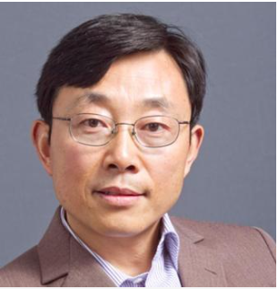
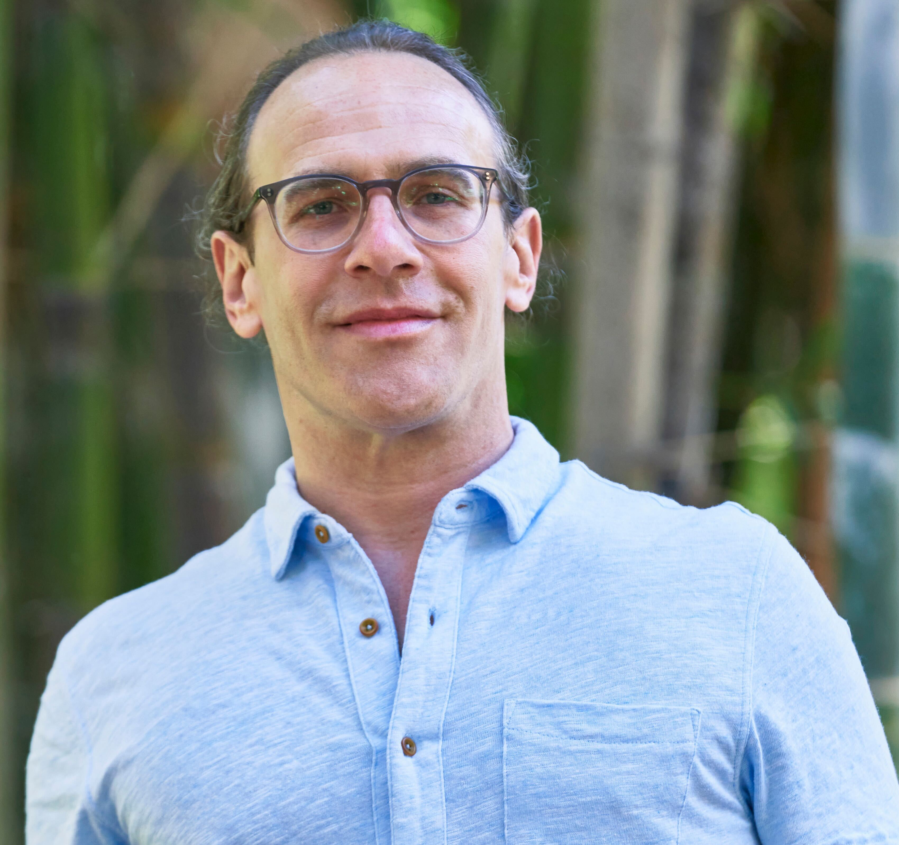

<h1 style="color:#202520; margin-left:150px; margin-right: 150px">Speakers: </h1>
<b style="color:#202520; margin-left:150px; margin-right: 150px">Sabeeha Merchant</b>
 

{:refdef: style="margin-left:150px"}

{: refdef}

<b>Presentation Title:</b> Not too bright, not too dark, just right: adjusting to light

Professor Sabeeha Merchant is a Distinguished Professor of Biochemistry, Biophysics, and Structural Biology, as well as, Plant Biology. Researching the single-cell alga, Chlamydomonas reinhardtii, she graduated with her PhD from the University of Wisconsin-Madison. 
Professor Merchant is currently a Professor of Plant and Microbial Biology at the University of California, Berkeley. Her group's research focuses on understanding the dynamics of essential trace-metal metabolism and homeostasis in green alga, Chlamydomonas reinhardtii, using it as a reference system in the context of chloroplast biology and photosynthesis. Their discoveries have been extended throughout the green algal lineage by the utilisation of comparative genomics. 
As we reduce our dependency on carbon-rich fossil fuels, the search for liquid fuel alternatives has intensified. Using systems biology approaches such as metabolomics, proteomics, and transcriptomics, the Merchant lab has deduced the metabolic pathways and regulatory factors that promote the synthesis of triglycerides in Chlamydomonas. Their research in this area is resulting in the emergence of Chromochloris zofingiensis as a reference organism due to its outstanding capacity accumulating the biodiesel precursors, triacylglycerols. 
Professor Sabeeha Merchant has been elected into the U.S. National Academy of Sciences, the American Academy of Arts and Sciences, the German Academy of Sciences Leopoldina and most recently recognised as a Pioneer Member of the American Society of Plant Biologists.
 
 

<b style="color:#202520; margin-left:150px; margin-right: 150px">Sheng Luan</b>
 

{:refdef: style="margin-left:150px"}

{: refdef}

<b>Presentation Title:</b> Calcium signaling and nutrient use efficiency in plants

Professor Sheng Luan is a professor in the department of Plant & Microbial Biology at UC Berkeley. In 2022 Professor Luan was awarded a Chancellor’s Professorship having demonstrated exceptional academic merit. He gained his PhD in Cellular and Developmental Biology from Harvard University and currently holds the position of Chancellor’s Professor and Chair of the Department of Plant and Microbial Biology at the University of California, Berkeley.
Professor Luan’s laboratory delves into how plants detect and react to environmental signals. Their research effort is focused on studying the calcium signaling mechanisms that encompass the encoding of calcium signatures through calcium channels and their decoding by the CBL-CIPK network. Downstream of these initial signaling processes, plants respond to changes in their environment by modifying biochemical processes, such as those occurring in the plasma membrane, vacuolar membrane, and chloroplasts.
With the primary goals of Professor Luan’s group focusing on elucidating the molecular mechanisms and biochemical pathways underlying plant response and adaption to its environment, their findings are extremely valuable for understanding the impact of climate change on plants.
Professor Sheng Luan has received the ASPB Fellow Award from the American Society of Plant Biologists, and has been highlighted by Web of Science, Clarivate as a Highly Cited Researcher for the past 8 years.
 
 

<b style="color:#202520; margin-left:150px; margin-right: 150px">Lawren Sack</b>
 

{:refdef: style="margin-left:150px"}

{: refdef}

<b>Presentation Title:</b>Plant drought sensitivity, from cells to ecosystems to continent

Professor Lawren Sack is a professor in the department of Ecology and Evolutionary Biology at UCLA. Professor Sack was named among the most highly cited researchers by UCLA in 2022, placing him among the world’s most influential researchers. Obtaining his PhD titled  “Plant Responses to Deep Shade Plus Drought” from the University of Cambridge, he now leads a lab at the University of California, Los Angeles as a Professor of Plant Ecology in the Department of Ecology and Evolutionary Biology. 
Lab members in Professor Sack’s group are engaged across a broad spectrum of projects with the common focus of understanding plant function, the evolution of structural and physiological diversity, and the implications for ecosystems under global change. The research undertaken by the group studies the mechanisms for function and co-existence of plant species, examining their responses to resources, ability to withstand environmental stresses, and competition. Furthermore, his laboratory investigates the evolutionary and functional implications of plant trait diversity, examining processes from the molecular and ecosystem level. In particular, focus is applied to leaf and plant hydraulics traits, drought tolerance, trait diversity within lineages, and the impacts of climate change on species and ecosystems as a whole. The insights gleaned from their research are being applied to advance forest and plant species conversation efforts under the challenges of climate change.
Professor Lawren Sack has already published a number of significant research papers this year, including the following titled “The ecosystem wilting point defines drought response and recovery of a Quercus-Carya forest.” - uncovering the threshold that initiates drought response in forests.
 
 
 
<b style="color:#202520; margin-left:150px; margin-right: 150px">Sara Lira</b>

<b>Presentation Title:</b> Partnerships for climate smart agriculture

<b style="color:#202520; margin-left:150px; margin-right: 150px">Andrew Latimer</b>

<b>Presentation Title:</b> How strong and persistent are negative wildfire feedbacks?

<b style="color:#202520; margin-left:150px; margin-right: 150px">Siobhan Brady</b>

<b>Presentation Title:</b> Cell Type Differentiation in a Changing Environment

<b style="color:#202520; margin-left:150px; margin-right: 150px">Forrest Li</b>

<b style="color:#202520; margin-left:150px; margin-right: 150px">Lidor Shaar-Moshe</b>

<b style="color:#202520; margin-left:150px; margin-right: 150px">Giulia Marino</b>

<b style="color:#202520; margin-left:150px; margin-right: 150px">Derek Young</b>

<b style="color:#202520; margin-left:150px; margin-right: 150px">Tom Buckley</b>

<b>Presentation Title:</b> A paean for beans: tooty fruit or climate savior?

<b style="color:#202520; margin-left:150px; margin-right: 150px">Louise Ferguson</b>

<b>Presentation Title:</b> Salinity Irrigation Management for California Pistachio

<b style="color:#202520; margin-left:150px; margin-right: 150px">Jeff Ross-Ibarra</b>

<b style="color:#202520; margin-left:150px; margin-right: 150px">Troy Magney</b>

<b>Presentation Title:</b> TSWIFT: Tower Spectrometer on Wheels for Investigating Frequent Timeseries of plant physiology

<b style="color:#202520; margin-left:150px; margin-right: 150px">Gail Taylor</b>
 

<!---
<h1 style="color:#202520; margin-left:150px; margin-right: 150px">  Plenary Speakers: </h1>

<b style="color:#202520; margin-left:150px; margin-right: 150px">Neelima Sinha</b>
 

{:refdef: style="margin-left:150px"}

{: refdef}

Dr. Sinha is a professor in the department of Plant Biology at UC Davis whose research is in plant evolutionary developmental biology. Her early work examined the genes controlling leaf development, and she demonstrated that the KNOTTED-1 homeobox (knox1) gene regulates leaf formation in maize. Building on that work, she showed that knox genes are involved in determining leaf shape, and she uncovered additional genes involved in leaf development. She has also carried out research on the molecular genetics of plant parasites. She was elected to be a fellow in the American Association for the Advancement of Science in 2005 and the American Society of Plant Biologists in 2018. <a href =  "http://sinhalab.ucdavis.edu/" target="_blank" rel="noopener noreferrer" style = "text-decoration: none">[Read more]</a>
 

<b style="color:#202520; margin-left:150px; margin-right: 150px">Awais Khan</b>
 

{:refdef: style="margin-left:150px"}

{: refdef}

Dr. Awais Khan joined Cornell University, Plant Pathology and Plant-Microbe Biology Section, as an Associate Professor in October 2016. Prior to taking this position, he was leading a global research program on genetics of adaptation and abiotic stress tolerance, at the International Potato Center (CIP), Lima, Peru. He earned a PhD from the Swiss Federal Institute of Technology (ETH), Zurich, Switzerland on fire blight of apples, and an MSc from Georg-August University, Gottingen, Germany, with further research experience at the University of York, UK and University of Illinois, Urbana-Champaign, USA. <a href =  "https://cals.cornell.edu/awais-khan" target="_blank" rel="noopener noreferrer" style = "text-decoration: none">[Read more]</a>
 

<b style="color:#202520; margin-left:150px; margin-right: 150px">Gerald Tuskan</b> 
 

{:refdef: style="margin-left:150px; margin-right: 150px"}

{: refdef}

Gerald Tuskan is currently director of the Center for Bioenergy Innovation, an institute designed to accelerate domestication of non-model plants and microbes to enable innovation across the bioenergy supply chain. He led the effort to sequence the first woody plant genome, Populus trichocarpa. <a href =  "https://www.esd.ornl.gov/PGG/tuskan_bio.htm" target="_blank" rel="noopener noreferrer" style = "text-decoration: none">[Read more]</a>

<h1 style="color:#202520; margin-left:150px; margin-right: 150px">  Corteva Speaker: </h1>

<b style="color:#202520; margin-left:150px; margin-right: 150px">Kyle Cheung</b>
 

{:refdef: style="margin-left:150px"}

{: refdef}

As a senior imaging data analyst at Corteva Agriscience since June 2020, Kyle collaborates with field scientists, project leaders, and data scientists to create and evaluate imaging phenotyping assays for crop protection evaluations. The main challenges in his position comes with scale: throughput, cost, and people. He leverages tools such as the NVIDIA ecosystem, Boston Dynamics Spot robot in Woodland, and cameras at different spatial scales. Kyle is a proud Aggie, graduating with his B.S. (2018) and M.S. (2020) in Biological Systems Engineering here at UC Davis. He worked in the Digital Agriculture Lab with Dr. Alireza Pourreza evaluating drought stress in turfgrass and predicting almond yield using sUAS platforms. <a href =  "https://kylehcheung.com/" target="_blank" rel="noopener noreferrer" style = "text-decoration: none">[Read more]</a>
 

 This page is under construction. Check back later for updates. 

--->
