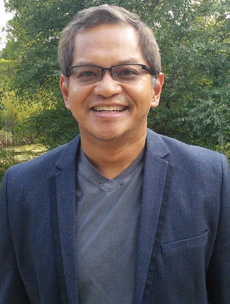

<!-- Banner -->
<!-- Note: The "styleN" class below should match that of the header element. -->
<section id="banner" class="style2">
	

		
			
		
		<header class="major">
			<h1>Speakers</h1>
		</header>
		

			
{{ page.description }}

		

	

</section>

<!-- Main -->

<!-- One -->
<section id="one">
	

		<header class="major">
		</header>
	

</section>

<!-- Two -->
<section id="two" class="spotlights">
	<section>
			
		

			

				<header class="major">
					<h3>Rex Bernardo</h3>
				</header>
				
Rex Bernardo is Professor and Endowed Chair in Corn Breeding and Genetics at the University of Minnesota. He conducts research on breeding methodology for quantitative traits and he teaches graduate courses in plant breeding. Dr. Bernardo obtained his B.S. degree in the Philippines in 1984, and his Ph.D. degree at the University of Illinois at Urbana-Champaign in 1988. Prior to coming to Minnesota in 2000, Dr. Bernardo was a research scientist at Limagrain Genetics and then a faculty member at Purdue University. He is a Fellow of the Crop Science Society of America and of the American Society of Agronomy, and a recipient of the Young Crop Scientist Award from the Crop Science Society of America and the Plant Breeding Impact Award from the National Association of Plant Breeders. Dr. Bernardo is the author of two textbooks: <i>Breeding for Quantitative Traits in Plants</i>, and <i>Essentials of Plant Breeding</i>.

			

		

	</section>

	<section>
			
		

			

				<header class="major">
					<h3>Maureen Hanson</h3>
				</header>
				
Dr. Maureen Hanson is Liberty Hyde Bailey Professor in the Department of Molecular Biology and Genetics at Cornell University, which she joined after an assistant professorship at the University of Virginia, Charlottesville. She has a diverse research program that includes the mechanism of RNA editing in plant organelles, the formation and function of chloroplast stromules, and improving photosynthesis through Rubisco engineering and synthetic biology. Earlier her lab was the first to identify both a single mitochondrial gene causing cytoplasmic male sterility and a single dominant nuclear gene encoding fertility restoration in the same species. Her recognitions include the Lawrence Bogorad Award from the American Society of Plant Biologists, the SUNY Chancellor’s Award for Faculty Service, the Cornell College of Agricultural and Life Sciences Award for Outstanding Accomplishments in Basic Research, and she is a Fellow of the American Association for the Advancement of Science. She has previously served as the Director of the NSF/DOE/USDA Cornell Plant Science Center and Training Group in Plant Molecular Biology. She was one of the founders of the International Society for Plant Molecular Biology and is currently Chair of the 2019 Gordon Conference on Chloroplast Biotechnology.

			

		

	</section>

</section>

