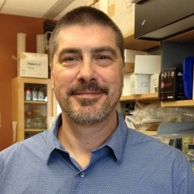
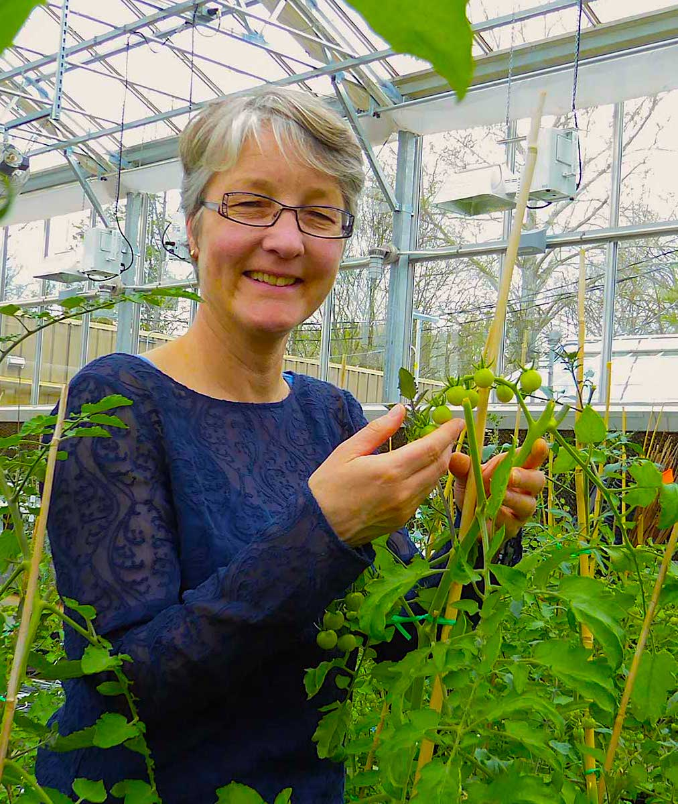
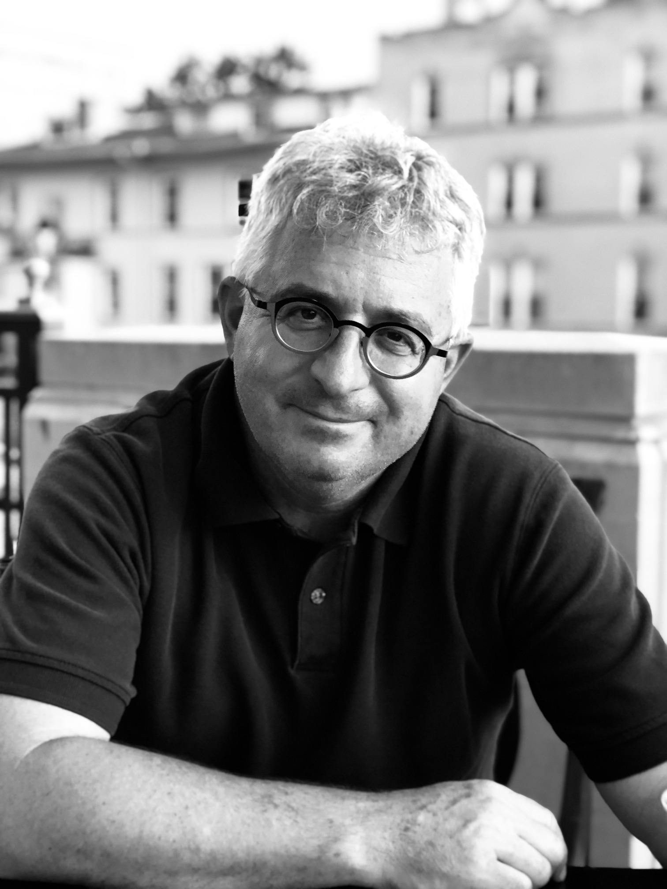
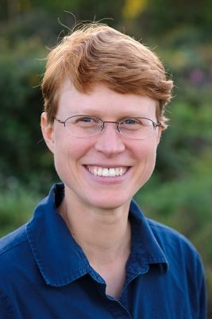
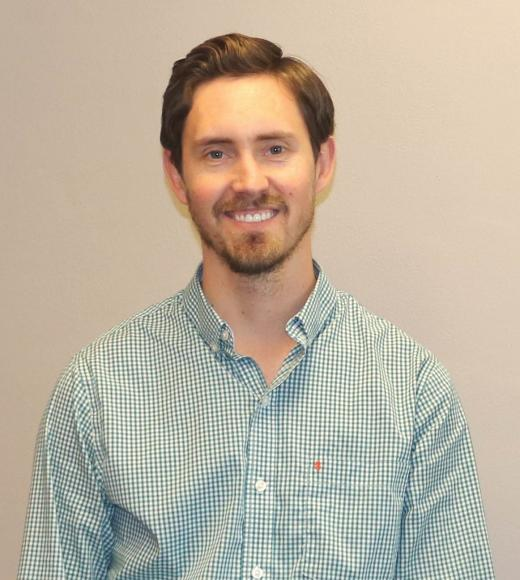
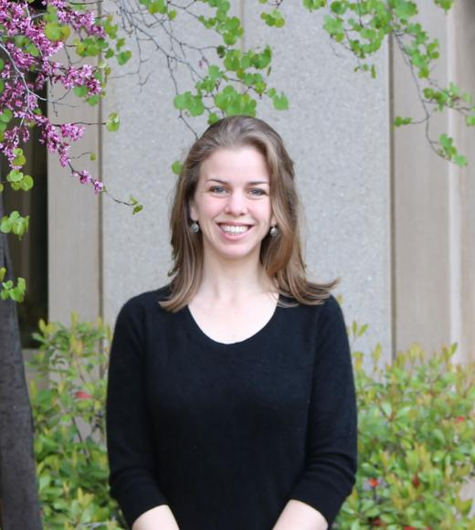
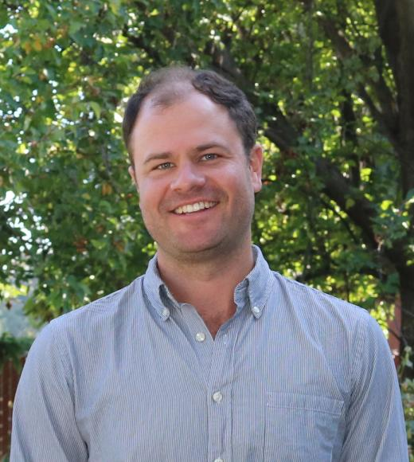

<!-- Banner -->
<!-- Note: The "styleN" class below should match that of the header element. -->
<section id="banner" class="style2">
	

		
			
		
		<header class="major">
			<h1>Speakers</h1>
		</header>
		

			
{{ page.description }}

		

	

</section>

<!-- Main -->

<!-- One -->
<section id="one">
	

		<header class="major">
        <h1 style="color:#ffffff;"> Keynote Speakers</h1>
		</header>
	

</section>

<!-- Two -->

<section id="two" class="spotlights">
	<section>
            
		

			

				<header class="major">
					<h3>CJ Schwartz</h3>
                    
				</header>
				
CJ Schwartz received his BS degree in Genetics from the University of Minnesota, a Ph.D. in Biochemistry at the University of Wisconsin, and a postdoc at the Salk Institute in San Diego with Joanne Chory and Detlef Weigel focusing on natural variation of light responsiveness. After nearly 20 years in academia, CJ founded a company 5 years ago (Sunrise Genetics), which applies modern molecular genetic techniques for gene discovery and MAS breeding in Cannabis. In collaboration with the University of Minnesota and the JCVI, Sunrise Genetics was the first to make public a high-quality Cannabis genome assembly, which is recognized as the Cannabis genomic reference accession by NCBI.
				

			

		

	</section>

	<section>
			
		

			

				<header class="major">
					<h3>Esther van der Knaap</h3>
                    
				</header>
				
 Esther van der Knaap received her BS/MS in Plant Pathology from Wageningen University in the Netherlands; her PhD in Genetics from the Plant Research Laboratory at Michigan State
University; and her post-doctoral training in Plant Breeding at Cornell University. She has been
at Ohio State University from 2001-2015 advancing through the ranks to associate professor in the department of Horticulture and Crop Science. From 2012 to 2015, Dr. van der Knaap held an affiliated scholar position at the College of Wooster. Since 2015, she is professor at the University of Georgia, Athens, in the department of Horticulture as well as in the Institute of
Plant Breeding, Genetics and Genomics. She is adjunct professor in Genetics and Plant Biology at UGA. The research in her lab focuses on the genetic, molecular and cellular bases of tomato
fruit morphology including the characterization and quantification of fruit shapes and sizes. She has published over 80 peer-reviewed articles and has been elected as a fellow of the American
Association for the Advancement of Science. Dr van der Knaap also received the Research Award of Merit from the Ohio Chapter of Gamma Sigma Delta; Distinguished Research Award
for the Top Junior Faculty within the Ohio Research and Development Center at The Ohio State University; and the NSF Young Investigator Award in Plant Genome Research.
				

			

		

	</section>

    <section>
            
        

            

                <header class="major">
                    <h3>Irwin Goldman</h3>
                    
                </header>
                
 
			Professor at UW-Madison since 1992. Graduate work at North Carolina State University and University of Wisconsin. Postdoctoral work at University of Illinois. Breeding carrot, onion, and table beet, and teaching World Vegetable Crops, Plant Breeding, Plants and Human Wellbeing, Evolutionary Biology, and Food and Seed Sovereignty.
                

            

        

    </section>

    <section>
            
        

            

                <header class="major">
                    <h3>Julie Dawson</h3>
                    
                </header>
                    
 
			Julie Dawson is an Associate Professor in the Department of Horticulture at the University of Wisconsin-Madison. Her background is in organic plant breeding and participatory research. Research topics include season extension methods, organic and participatory variety trials and variety selection for small-acreage farms and gardens as well as extension resources for urban growers. She leads a project called the Seed to Kitchen Collaborative with other plant breeders to test varieties with local farmers and chefs, focused on flavor for local food systems.
                    

            

        

    </section>

</section>

<!-- Three -->
<section id="three" style="background-color:#c99700;>
	

		<header class="major">
        <h1 style="color:#ffffff;"> UC Davis Spotlight</h1>
		</header>
	

</section>

<!-- Four -->
<section id="four" class="spotlights">
	<section>
            
		

			

				<header class="major">
					<h3>Brian Bailey</h3>
                    
				</header>
				
 Brian Bailey started as an assistant professor in the UC Davis Plant Sciences Department in 2016. His research combines engineering, computer science, atmospheric science, and biology to study plant systems. In particular, Brian's lab is developing high-resolution, 3D models and measurement techniques that can explicitly represent plant-environment interactions at scales ranging from leaves to canopies. Recent work in the Bailey lab has focused on developing models for woody perennial crops such as almond and grapevine. Brian received his MS and PhD degrees in mechanical engineering from the University of Utah.
				

			

		

	</section>

	<section>
			
		

			

				<header class="major">
					<h3>Christine Diepenbrock</h3>
                    
				</header>
				
 Christine Diepenbrock is an assistant professor in Plant Sciences at UC Davis, focused on understanding and improving crop nutritional quality and abiotic stress tolerance in staple and specialty crops. So far, she and her group have focused on dissecting the genetic basis of nutritional quality traits and integrating crop physiology and genomics. Christine obtained a Ph.D. in Plant Breeding and Genetics at Cornell University and a Bachelor’s degree in Biology: Molecular Biology and Biochemistry from Washington University in St. Louis.
				

			

		

	</section>

    <section>
            
        

            

                <header class="major">
                    <h3>Troy Magney</h3>
                    
                </header>
                
Troy is an Assistant Professor this year in the Department of Plant Sciences. He was most recently a research scientist in the Carbon Cycle and Ecosystems group at the NASA Jet Propulsion Laboratory in Pasadena, CA.  His research tries to ‘see’ the things that feed our families, clean our air, and nourish our ecosystems a little differently. His lab group distills images of fields and forests into a kaleidoscope of colors to inform our understanding of plant health, productivity, and stress.
                

            

        

    </section>

    
</section>

