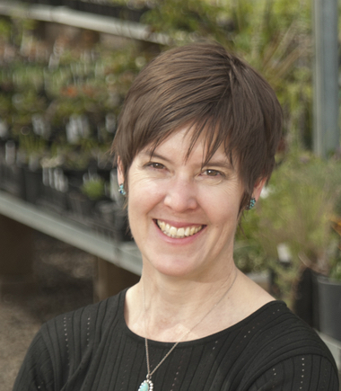
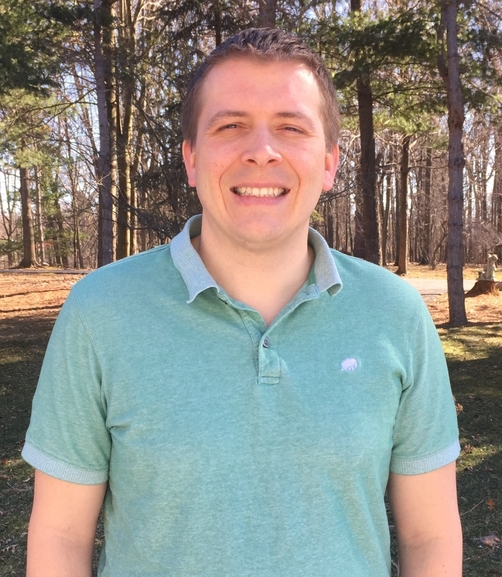
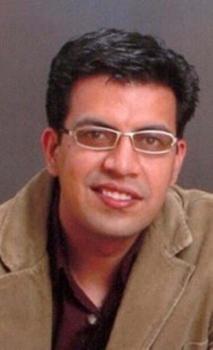
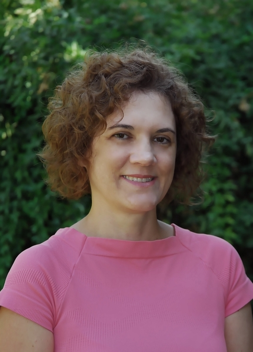
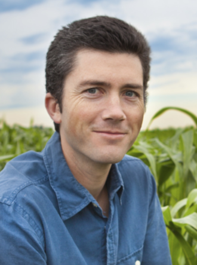

<!-- Banner -->
<!-- Note: The "styleN" class below should match that of the header element. -->
<section id="banner" class="style2">
	

		
			
		
		<header class="major">
			<h1>Speakers</h1>
		</header>
		

			
{{ page.description }}

		

	

</section>

<!-- Main -->

<!-- One -->
<section id="one">
	

		<header class="major">
        <h1 style="color:#ffffff;"> Keynote Speakers</h1>
		</header>
	

</section>

<!-- Two -->

<section id="two" class="spotlights">

	<section>
            
		

			

				<header class="major">
					<h3>Robin Hopkins</h3>
                    
				</header>
				
Dr. Robin Hopkins is an Assistant Professor in the Department of Organismic and Evolutionary Biology at Harvard University. She received her PhD from Duke University where she studied the genetics, ecology, and evolution of speciation in plants.  Prior to starting her lab at the Arnold Arboretum of Harvard University, she was awarded a National Science Foundation Postdoctoral Research Fellowship in Biology to use mathematical models to investigate the role of natural selection in speciation. Her research characterizes and quantifies the forces of selection, gene flow, and mutation during the process of speciation. She integrates genetic, genomic, and field bases research to understand the ecological and evolutionary consequences of hybridization, and how closely related plant lineages have evolved barriers to prevent reproducing.
				

			

		

	</section>

	<section>
			
		

			

				<header class="major">
					<h3>José Dinneny</h3>
                    
				</header>
				
José Dinneny received his BS from UC Berkeley in Plant Biology and Genetics in the Department of Plant and Microbial Biology and PhD from UC San Diego working with Detlef Weigel at the Salk Institute for Biological Science and Martin Yanofsky in the Division of Biology, UCSD. His work focused on the cloning and characterization of JAGGED and NUBBIN in flower and fruit development. He then went to Duke University to do his post-doctoral studies with Philip Benfey. There he utilized Fluorescence Activated Cell Sorting (FACS) to develop the first tissue-specific map of transcriptional changes occurring during abiotic stress. José established his independent lab at the Temasek Lifesciences Laboratory (TLL) in Singapore with a joint appointment at the National University of Singapore, Department of Biological Sciences. He was an inaugural fellow of the National Research Foundation, Singapore. José moved his lab in 2011 to the Carnegie Institution for Science, Department of Plant Biology. In 2018 José joined the faculty at Stanford University in the Biology Department as an Associate Professor.
				

			

		

	</section>

    <section>
            
        

            

                <header class="major">
                    <h3>edit</h3>
                    
                </header>
                
 edit
                

            

        

    </section>

    <section>
            
        

            

                <header class="major">
                    <h3>Stacey Harmer</h3>
                    
                </header>
                    
Dr. Stacey Harmer is a Professor in the Department of Plant Biology at UC Davis.  She earned a PhD in Biochemistry at UC San Francisco and then moved to a postdoctoral scholar position at the Scripps Research Institute.  Her lab studies plant adaptations to the abiotic environment.  Specifically, her research focuses on the plant circadian clock, addressing both the molecular nature of the oscillator that generates daily rhythms and aspects of plant physiology affected by the circadian system.  She is particularly interested in exploring relationships between clock, light, and growth signaling pathways. Her recognitions have included a Howard Hughes Predoctoral Fellowship, an NIH National Research Service Award, an American Society for Photobiology New Investigator Award, and the UC Davis Chancellor's Fellowship.
                    

            

        

    </section>

    <section>
            
        

            

                <header class="major">
                    <h3>Patrick Edger</h3>
                    
                    </header>
                    
Dr. Patrick Edger is an Assistant Professor in the Department of Horticulture at Michigan State University. Patrick received his PhD degree from the University of Missouri in 2012, and was a NSF National Plant Genome Initiative Postdoctoral Fellow at UC-Berkeley and University of Arizona from 2012-2015. He joined the Michigan State University faculty in Fall 2015. His lab leverages a diverse array of tools and a strong multidisciplinary approach, including comparative genomics, transcriptomics, and systems biology, to investigate gene family dynamics and the evolution of gene-gene interactions following gene and genome duplications. His current research focuses on uncovering the mechanistic basis of subgenome dominance in polyploid crops, largely to guide breeding efforts in blueberry and strawberry.
                    

            

        

    </section>

    <section>
        
            

                

                    <header class="major">
                    <h3>Lucia Gutierrez</h3>
                    
                    </header>
                    
Dr. Lucia Gutierrez focuses on breeding cereals, such as oats, wheat, and barley, for more sustainable agricultural systems through the study of complex quantitative traits and the development, comparison, and deployment of new methodologies for quantitative genetics data analysis for plant breeding. Her program uses genomic data to unveil new genetic diversity to deploy in breeding programs in three areas: 1) population genetics and diversity; 2) quantitative genetics applied to plant breeding; and 3) experimental designs and multi-environment studies for large genetic data.
                    

                

            

    </section>

    <section>
        
            

                

                    <header class="major">
                    <h3>Amit Sethi</h3>
                    
                    </header>
                    
Dr. Amit Sethi leads the Durability and Resistance Management group at DowDuPont, focusing on delivering Insect Resistance Management knowledge and strategies related to internal and external customers globally that aid in product characterization, development and deployment. His team activities involve developing resistant insect colonies against pre- and post-commercial traits, conducting ecological and genomic studies related to cross-resistance, trait efficacy and compatibility, insect survivorship, refuge deployment, resistance monitoring and characterization, and trait durability modeling. Amit holds a BS degree in Agriculture (Hons. In Plant Protection) and a M.S. degree in Entomology from Punjab Agricultural University, an MBA in Operations Management from the Indira Gandhi National Open University, a PhD in Entomology from the University of Florida, and Post-Doctoral experience from Louisiana State University and Purdue University. 
                    

                

            

    </section>
</section>

<!-- Three -->
<section id="three" style="background-color:#c99700;>
	

		<header class="major">
        <h1 style="color:#ffffff;"> UC Davis Spotlight</h1>
		</header>
	

</section>

<!-- Four -->

<section id="four" class="spotlights">

	<section>
            
		

			

				<header class="major">
					<h3>Diane M. Beckles</h3>
                    
				</header>
				
Diane M Beckles is an Associate Professor and Associate Postharvest Biochemist in the Department of Plant Sciences at the University of California, Davis. Dr. Beckles’ research is focused on identifying genes and environmental factors that determine the postharvest quality of horticultural crops and cereals. Her primary interests are in starch biosynthesis and structure, and the postharvest chilling injury of horticultural crops. Her lab aims to understand the molecular basis of quality components in fruit, vegetable and cereals in order to optimize value for the consumer, thereby reducing food waste and lost. Her expertise ranges from molecular physiology to the structural and chemical analysis of biomaterials. She is the author of over 50 research articles, book chapters and technical articles. She has served as an expert reviewer for over 20 different journals that span genomics, genetics, food sciences, plant physiology and biochemistry, and has served on federal grant panels on crop improvement and integrative biology. She also advises research groups and students in China, Nigeria, Thailand and Tanzania. Dr. Beckles received her Bachelor’s degree in Biotechnology from University of Sheffield, (UK), and her PhD. from the University of Cambridge (UK), with postdoctoral research at DuPont Agricultural Biotechnology (USA). She is a member of the American Society of Horticultural Science, and the International Society of Horticultural Science. 

				

			

		

	</section>

	<section>
			
		

			

				<header class="major">
					<h3>Emily Josephs</h3>
                    
				</header>
				
 Dr. Emily Josephs is a evolutionary geneticist who uses population genomics and quantitative genetics to understand how selection shapes genetic variation in wild and domesticated plants. She received her PhD from the University of Toronto in 2016 and is currently an NSF Postdoctoral Fellow at the University of California, Davis. In January 2019, Emily will start a position as an assistant professor in the Plant Biology department at Michigan State University.
				

			

		

	</section>

    <section>
            
        

            

                <header class="major">
                    <h3>Maeli Melotto</h3>
                    
                </header>
                
Dr. Maeli Melotto is an assistant professor in the Department of Plant Sciences at UC Davis. Dr. Melotto completed her Ph.D. in plant breeding and genetics at Michigan State University before joining the UC Davis faculty in 2014. Her research is focused on understanding the close interaction between plants and pathogens at the molecular level. Her work aims to determine the physiological changes that happen in both the plant and the pathogen when they come into contact. Specifically to understand how the plant immune system works to fight against pathogen infection and how pathogens employ virulence strategies to overcome plant defenses. This line of research is critical for the development of environmentally sound methods to minimize the impact of diseases and economic losses in agriculture worldwide, and to reduce food contamination with human pathogens in crops such as leafy vegetables.
                

            

        

    </section>

    <section>
            
        

            

                <header class="major">
                    <h3>Patrick Brown</h3>
                    
                </header>
                    
Dr. Patrick Brown is a plant breeder and geneticist focused on the integration of genomic and high-throughput phenotyping technology into applied plant breeding programs. From 2010-2017 he was a faculty member at the University of Illinois working on genetic improvement and abiotic stress resistance of sorghum, maize, and wheat. In July 2017, Brown moved into a position in tree breeding at UC Davis focused on walnut and pistachio.
                    

            

        

    </section>
</section>

