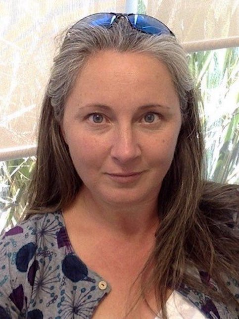
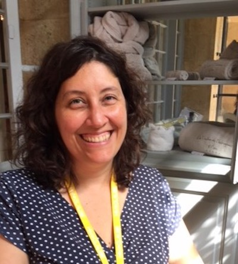

<!-- Banner -->
<!-- Note: The "styleN" class below should match that of the header element. -->
<section id="banner" class="style2">
	

		
			
		
		<header class="major">
			<h1>Speakers</h1>
		</header>
		

			
{{ page.description }}

		

	

</section>

<!-- Main -->

<!-- One -->
<section id="one">
	

		<header class="major">
        <h1 style="color:#ffffff;"> Keynote Speakers</h1>
		</header>
	

</section>

<!-- Two -->

<section id="two" class="spotlights">

	<section>
            
		

			

				<header class="major">
					<h3>Rex Bernardo</h3>
				</header>
				
Rex Bernardo is Professor and Endowed Chair in Corn Breeding and Genetics at the University of Minnesota. He conducts research on breeding methodology for quantitative traits and he teaches graduate courses in plant breeding. Dr. Bernardo obtained his B.S. degree in the Philippines in 1984, and his Ph.D. degree at the University of Illinois at Urbana-Champaign in 1988. Prior to coming to Minnesota in 2000, Dr. Bernardo was a research scientist at Limagrain Genetics and then a faculty member at Purdue University. He is a Fellow of the Crop Science Society of America and of the American Society of Agronomy, and a recipient of the Young Crop Scientist Award from the Crop Science Society of America and the Plant Breeding Impact Award from the National Association of Plant Breeders. Dr. Bernardo is the author of two textbooks: <i>Breeding for Quantitative Traits in Plants</i>, and <i>Essentials of Plant Breeding</i>.

			

		

	</section>

	<section>
			
		

			

				<header class="major">
					<h3>Maureen Hanson</h3>
				</header>
				
Dr. Maureen Hanson is Liberty Hyde Bailey Professor in the Department of Molecular Biology and Genetics at Cornell University, which she joined after an assistant professorship at the University of Virginia, Charlottesville. She has a diverse research program that includes the mechanism of RNA editing in plant organelles, the formation and function of chloroplast stromules, and improving photosynthesis through Rubisco engineering and synthetic biology. Earlier her lab was the first to identify both a single mitochondrial gene causing cytoplasmic male sterility and a single dominant nuclear gene encoding fertility restoration in the same species. Her recognitions include the Lawrence Bogorad Award from the American Society of Plant Biologists, the SUNY Chancellor’s Award for Faculty Service, the Cornell College of Agricultural and Life Sciences Award for Outstanding Accomplishments in Basic Research, and she is a Fellow of the American Association for the Advancement of Science. She has previously served as the Director of the NSF/DOE/USDA Cornell Plant Science Center and Training Group in Plant Molecular Biology. She was one of the founders of the International Society for Plant Molecular Biology and is currently Chair of the 2019 Gordon Conference on Chloroplast Biotechnology.

			

		

	</section>

    <section>
            
        

            

                <header class="major">
                    <h3>Christopher Topp</h3>
                </header>
                
Christopher Topp is an Assistant Investigator at the Donald Danforth Plant Science Center (since 2013), a non-profit plant science research institute. For the past fifteen years, Dr. Topp has studied fundamental processes, both small and large, that drive the growth and productivity of crop plants. Originally trained as a centromere biologist at the University of Georgia (PhD; 2003-2009), he studied the biochemistry and evolution of cell division machinery in maize and oats. As a USDA-NIFA postdoctoral scholar (2011-2013) at Duke University (2009-2013), he led a team of engineers, computer scientists, and biologists in the development of a 3D root imaging and analysis pipeline, which was used to map regions of the rice genome controlling root growth. His current research focuses on subterranean phenotyping in multiple crop species, as well as identifying the environmental and genetic factors that condition their growth. By integrating these efforts with natural variation and modern genomics, he aims to contribute to the development of new crop varieties with root systems capable of drought tolerance and efficient nutrient uptake. His team at the Danforth Center continues to develop technologies and infrastructure that enable the analysis of the ‘hidden half’ of plants.
                

            

        

    </section>

    <section>
            
        

            

                <header class="major">
                    <h3>Sean Myles</h3>
                </header>
                    
Sean Myles is an Assistant Professor at Dalhousie University. His group is dedicated to preserving biodiversity in agriculture.  They maintain over 1000 apple varieties in our Apple Biodiversity Collection, which includes not only well-known dessert and cider apples, but also long lost heirloom varieties and even wild apples from the forests of Central Asia.  They study the tremendous natural diversity of apples and are figuring out ways to breed new apple varieties that are tasty and require less chemical input to grow.
                    

            

        

    </section>

    <section>
            
        

            

                <header class="major">
                    <h3>Sarah Hearne</h3>
                    </header>
                    
 Sarah Hearne manages the maize research portfolio for the Seeds of Discovery (SeeD) initiative at CIMMYT. Her work comprises development of new analytical approaches to explore and understand maize genetic diversity through the application of next generation sequencing, assessment of the genetic diversity of the entire CIMMYT genebank collection of maize and other publically accessible maize genetic resources including ex PVP temperate materials, GWAS for high priority traits across the world’s most diverse maize panel, genomic selection for abiotic stress characters from maize landraces including; model training, population formation, selection techniques and breeding methods for GS advancement to optimise landrace based pre-breeding approaches for oligo and polygenic traits, selection footprint evaluation for key abiotic, biotic and anthropogenic characteristics of maize landraces, and curation and GIS enrichment of maize genebank passport data.
                    

            

        

    </section>

    <section>
        
            

                

                    <header class="major">
                    <h3>Jillian Foerster</h3>
                    </header>
                    
 
                    

                

            

    </section>

</section>

<!-- Three -->
<section id="three" style="background-color:#002855;">
    

        <header class="major">
        <h1 style="color:#ffffff;"> UC-Davis Faculty Spotlight</h1>
        </header>
    

</section>

<!-- Four -->

<section id="four" class="spotlights">

<section style="background-color:#c99700;">
        
            

                

                    <header class="major">
                    <h3>Daniel Runcie</h3>
                    </header>
                    

                

            

    </section>

    <section style="background-color:#002855;">
        
            

                

                    <header class="major">
                    <h3>Florence Zakharov</h3>
                    </header>
                    

                

            

    </section>

    <section style="background-color:#c99700;">
        
            

                

                    <header class="major">
                    <h3>Siobhan Brady</h3>
                    </header>
                    
Siobhan Brady received her PhD at the University of Toronto in 2005, and was a Natural Sciences and Engineering Research Council of Canada Postdoctoral Fellow at Duke University from 2005 – 2008. In 2009 she began an Assistant Professor Position and became an Associate Professor in 2015 at the University of California, Davis in the Department of Plant Biology and in the Genome Center. In 2016 she was named as a Howard Hughes Medical Institute Faculty Research Scholar. Research in the Brady lab focuses on the global regulation of gene expression and its contribution to root morphology and development in Arabidopsis thaliana, Solanum species, Sorghum bicolor and maize.

                

            

    </section>

    <section style="background-color:#002855;">
        
            

                

                    <header class="major">
                    <h3>Alan Rose</h3>
                    </header>
                    

                

            

    </section>

