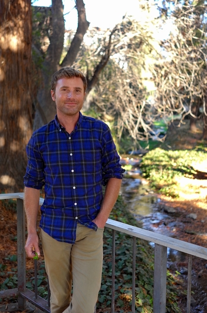
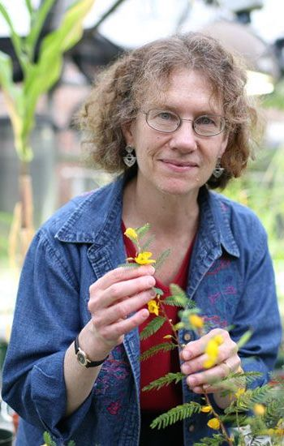
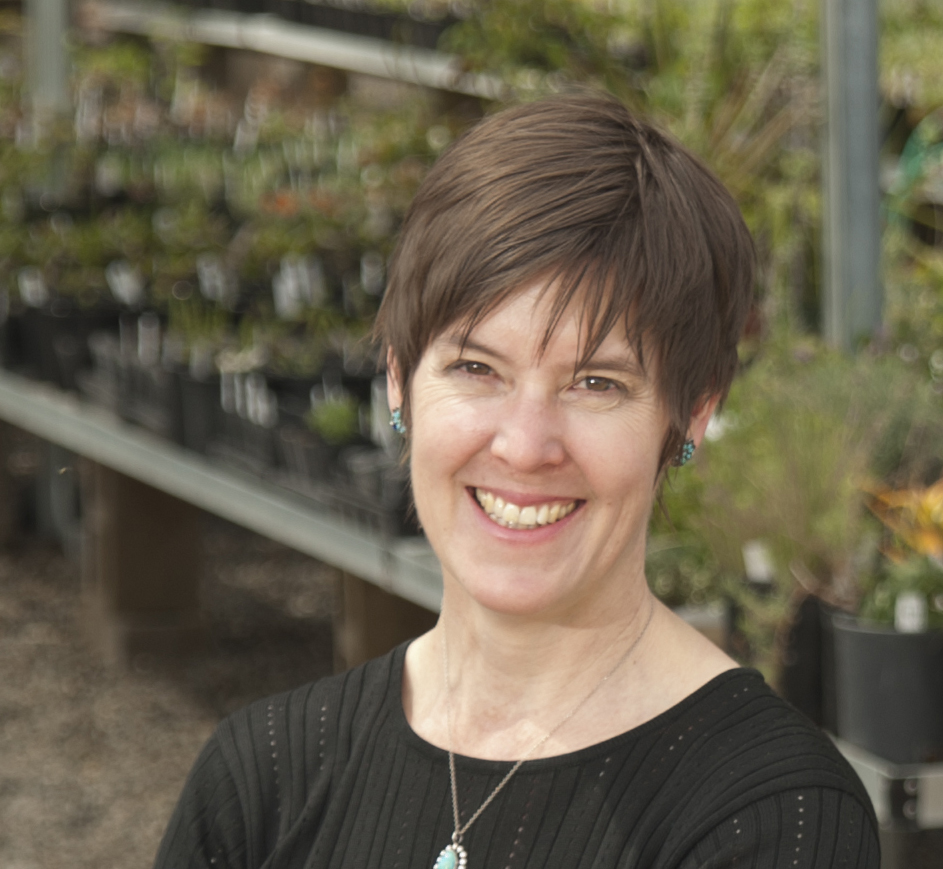
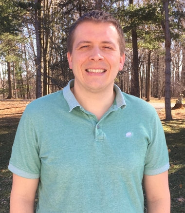
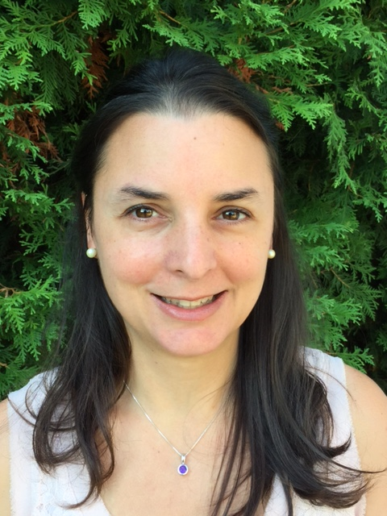
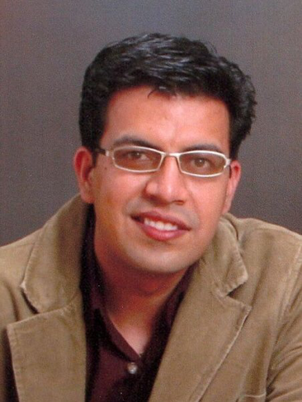
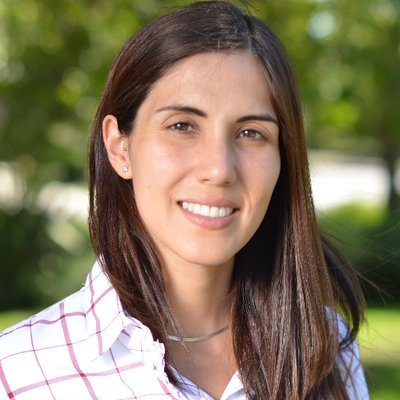
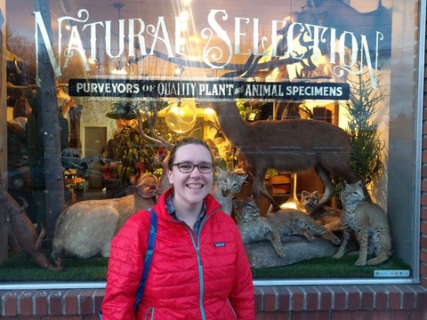
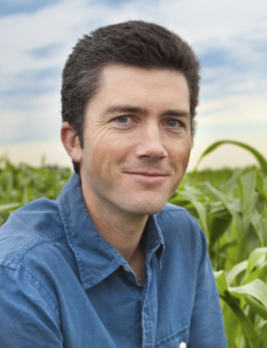
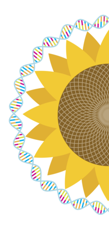

<!-- Banner -->
<!-- Note: The "styleN" class below should match that of the header element. -->
<section id="banner" class="style2">
	

		
			
		
		<header class="major">
			<h1>Speakers</h1>
		</header>
		

			
{{ page.description }}

		

	

</section>

<!-- Main -->

<!-- One -->
<section id="one">
	

		<header class="major">
        <h1 style="color:#ffffff;"> Keynote Speakers</h1>
		</header>
	

</section>

<!-- Two -->

<section id="two" class="spotlights">

	<section>
            
		

			

				<header class="major">
					<h3>Noah Whiteman</h3>
                    
				</header>
				
Dr. Noah Whiteman is an evolutionary biologist and is currently an associate professor at the University of California, Berkeley in the Department of Integrative Biology. He studied for an M.S. degree in systematic entomology at the University of Missouri-Columbia where he was trained as a classical entomologist. Noah stayed on in Missouri for his Ph.D. In 2006 Noah left Missouri for Harvard University where he completed an NIH postdoctoral fellowship on genomics of plant-insect-microbe interactions. He continued in this field of work as an assistant and then associate professor in the Department of Ecology and Evolutionary Biology at the University of Arizona.
				

			

		

	</section>

	<section>
			
		

			

				<header class="major">
					<h3>Elizabeth "Toby" Kellogg</h3>
                    
				</header>
				
Dr. Elizabeth (Toby) Kellogg is the Robert E. King Distinguished Investigator at the Donald Danforth Plant Science Center in St. Louis, Missouri. Her lab studies cereal crops and their wild relatives in the grass family, using both natural diversity to unlock the genetic potential of the crops, and also the genetic tools of the crops to understand natural diversity. She has discovered genes that affect seed production in crops and in the wild, and has studied grass evolution and genomics. She has published well over 150 papers, is co-author of two textbooks, and is sole author of a book on the evolution and classification of the grass family.  In addition to her Ph.D. degree from Harvard University, she has been awarded an honorary doctorate from the University of Córdoba in Argentina.  She has received a Guggenheim Fellowship and the Chancellor's Award for Research and Creativity at the University of Missouri-St. Louis, where she held an endowed chair for 15 years before moving to the Danforth Center.  She has been elected a Fellow of the American Academy for the Advancement of Science (AAAS), a Fellow of the Academia Nacional de Ciencias, Argentina, and has served as President of the American Society of Plant Taxonomists, the Society for Systematic Biology, the Botanical Society of America, and the Biological Sciences section of the AAAS.
				

			

		

	</section>

    <section>
            
        

            

                <header class="major">
                    <h3>Daniel Chitwood</h3>
                    
                </header>
                
Dr. Dan Chitwood's research focuses on developing methods to measure and quantify plant morphology. His interest in plant morphology began with studying leaf development and the contribution of small RNA movement to adaxial-abaxial ("dorsal-ventral") patterning with Dr. Marja Timmermans at Cold Spring Harbor Laboratory. He then studied natural variation in leaf shape among tomato and its wild relatives with Dr. Neelima Sinha at U.C. Davis. It was during this time that Dr. Chitwood realized a need to develop statistics to quantify subtle differences in shape between tomato near-isogenic introgression lines. Currently, Dr. Chitwood is at Michigan State University in the Departments of Horticulture and Computational Mathematics, Science and Engineering. He will be using X-ray Computed Tomography to create 3D and 4D models of plant architecture and working with mathematicians to develop topological models of morphology.
                

            

        

    </section>

    <section>
            
        

            

                <header class="major">
                    <h3>Stacey Harmer</h3>
                    
                </header>
                    
Dr. Stacey Harmer is a Professor in the Department of Plant Biology at UC Davis.  She earned a PhD in Biochemistry at UC San Francisco and then moved to a postdoctoral scholar position at the Scripps Research Institute.  Her lab studies plant adaptations to the abiotic environment.  Specifically, her research focuses on the plant circadian clock, addressing both the molecular nature of the oscillator that generates daily rhythms and aspects of plant physiology affected by the circadian system.  She is particularly interested in exploring relationships between clock, light, and growth signaling pathways. Her recognitions have included a Howard Hughes Predoctoral Fellowship, an NIH National Research Service Award, an American Society for Photobiology New Investigator Award, and the UC Davis Chancellor's Fellowship.
                    

            

        

    </section>

    <section>
            
        

            

                <header class="major">
                    <h3>Patrick Edger</h3>
                    
                    </header>
                    
Dr. Patrick Edger is an Assistant Professor in the Department of Horticulture at Michigan State University. Patrick received his PhD degree from the University of Missouri in 2012, and was a NSF National Plant Genome Initiative Postdoctoral Fellow at UC-Berkeley and University of Arizona from 2012-2015. He joined the Michigan State University faculty in Fall 2015. His lab leverages a diverse array of tools and a strong multidisciplinary approach, including comparative genomics, transcriptomics, and systems biology, to investigate gene family dynamics and the evolution of gene-gene interactions following gene and genome duplications. His current research focuses on uncovering the mechanistic basis of subgenome dominance in polyploid crops, largely to guide breeding efforts in blueberry and strawberry.
                    

            

        

    </section>

    <section>
        
            

                

                    <header class="major">
                    <h3>Lucia Gutierrez</h3>
                    
                    </header>
                    
Dr. Dr. Lucia Gutierrez focuses on breeding cereals, such as oats, wheat, and barley, for more sustainable agricultural systems through the study of complex quantitative traits and the development, comparison, and deployment of new methodologies for quantitative genetics data analysis for plant breeding. Her program uses genomic data to unveil new genetic diversity to deploy in breeding programs in three areas: 1) population genetics and diversity; 2) quantitative genetics applied to plant breeding; and 3) experimental designs and multi-environment studies for large genetic data.
                    

                

            

    </section>

    <section>
        
            

                

                    <header class="major">
                    <h3>Amit Sethi</h3>
                    
                    </header>
                    
Dr. Dr. Amit Sethi, Senior Research Manager, leads the Durability and Resistance Management group at DowDuPont, focusing on delivering Insect Resistance Management (IRM) knowledge and strategy related to all crops to internal and external customers globally that aid in product characterization, development and deployment. His team activities involve developing resistant insect colonies against pre- and post-commercial traits, conducting ecological and genomic studies related to cross-resistance, trait efficacy and compatibility, insect survivorship, refuge deployment, resistance monitoring and characterization, and trait durability modeling. Amit holds a B.S. degree in Agriculture (Hons. In Plant Protection) and a M.S. degree in Entomology from Punjab Agricultural University, an M.B.A. in Operations Management from the Indira Gandhi National Open University, a Ph.D. in Entomology from the University of Florida, and Post-Doctoral experience from Louisiana State University and Purdue University. 
                    

                

            

    </section>
</section>

<!-- Three -->
<section id="three" style="background-color:#c99700;>
	

		<header class="major">
        <h1 style="color:#ffffff;"> UC Davis Spotlight</h1>
		</header>
	

</section>

<!-- Four -->

<section id="four" class="spotlights">

	<section>
            
		

			

				<header class="major">
					<h3>Barbara Blanco-Ulate</h3>
                    
				</header>
				
Dr. Blanco-Ulate's Bio Coming Soon!
				

			

		

	</section>

	<section>
			
		

			

				<header class="major">
					<h3>Emily Josephs</h3>
                    
				</header>
				
 Dr. Emily Josephs is a evolutionary geneticist who uses population genomics and quantitative genetics to understand how selection shapes genetic variation in wild and domesticated plants. She received her PhD from the University of Toronto in 2016 and is currently an NSF Postdoctoral Fellow at the University of California, Davis. In January 2019, Emily will start a position as an assistant professor in the Plant Biology department at Michigan State University.
				

			

		

	</section>

    <section>
            
        

            

                <header class="major">
                    <h3>Maeli Melotto</h3>
                    
                </header>
                
Dr. Melotto's Bio Coming Soon!
                

            

        

    </section>

    <section>
            
        

            

                <header class="major">
                    <h3>Patrick Brown</h3>
                    
                </header>
                    
Dr. Patrick Brown is a plant breeder and geneticist focused on the integration of genomic and high-throughput phenotyping technology into applied plant breeding programs. From 2010-2017 he was a faculty member at the University of Illinois working on genetic improvement and abiotic stress resistance of sorghum, maize, and wheat. In July 2017, Brown moved into a position in tree breeding at UC Davis focused on walnut and pistachio.
                    

            

        

    </section>
</section>

<!-- Five -->
<section id="five" style="background-color:#002855;">
    

        <header class="major">
        <h1 style="color:#ffffff;"> Student and Post-Doctoral Speakers</h1>
        </header>
    

</section>

<!-- Six -->
<section id="six" class="spotlights">

    <section style="background-color:#c99700;">
        
            

                

                    <header class="major" style="color:#000000;">
                    <h3>TBD</h3>
                    </header>
                    
 Bio Coming Soon!
                    

                

            

    </section>

    <section style="background-color:#002855;">
        
            

                

                    <header class="major" style="color:#000000;">
                    <h3>TBD</h3>
                    </header>
                    
 Bio Coming Soon!
                    

                

            

    </section>

    <section style="background-color:#c99700;">
        
            

                

                    <header class="major" style="color:#000000;">
                    <h3>TBD</h3>
                    </header>
                    
 Bio Coming Soon!
                    

                

            

    </section>
    
    <section style="background-color:#002855;">
        
            

                

                    <header class="major" style="color:#000000;">
                    <h3>TBD</h3>
                    </header>
                    
 Bio Coming Soon!
                    

                

            

    </section>

</section>

