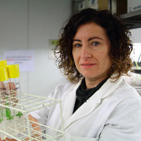
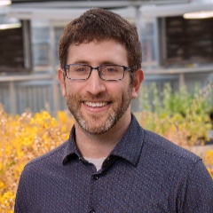
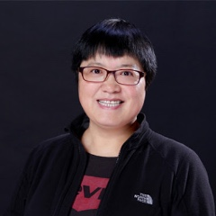
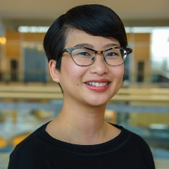
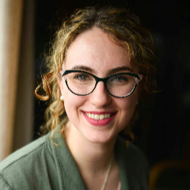
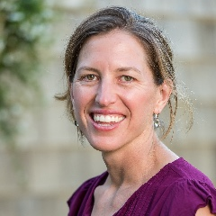
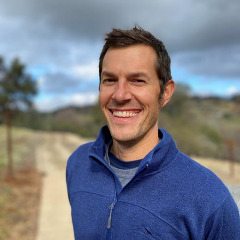
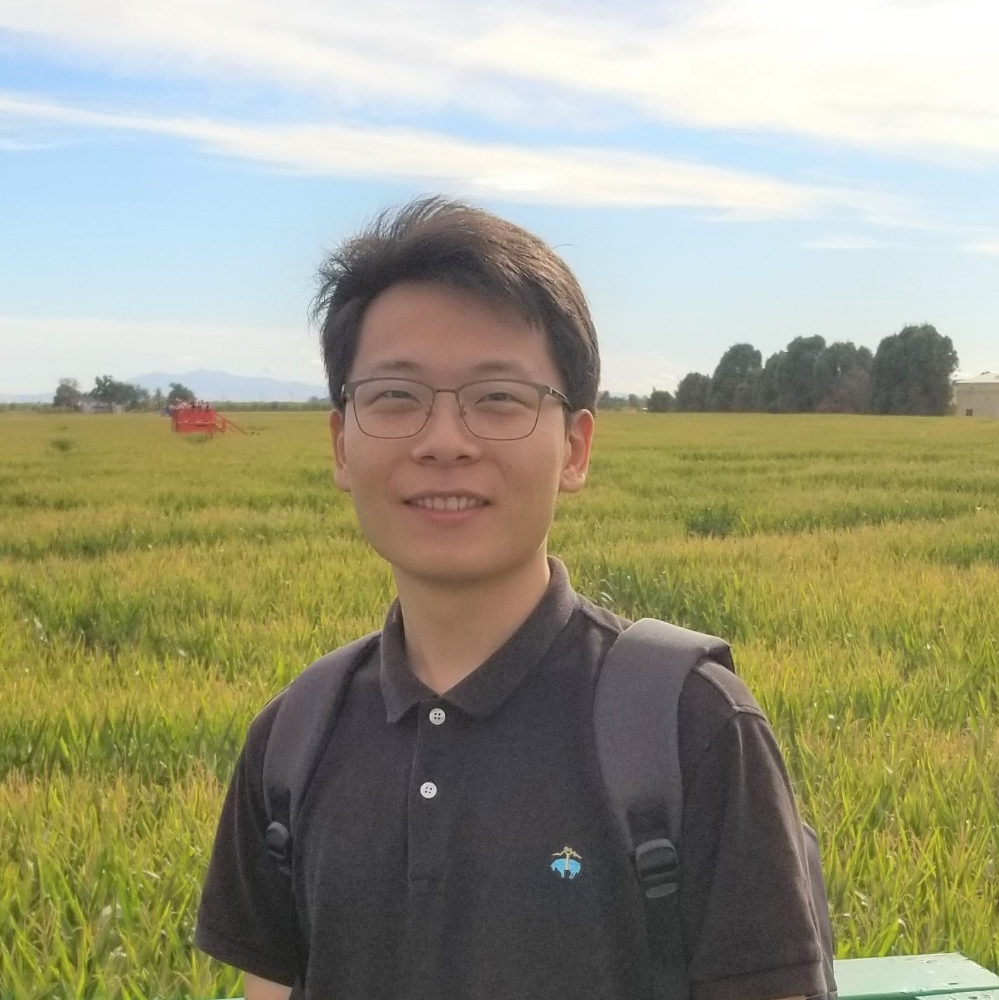
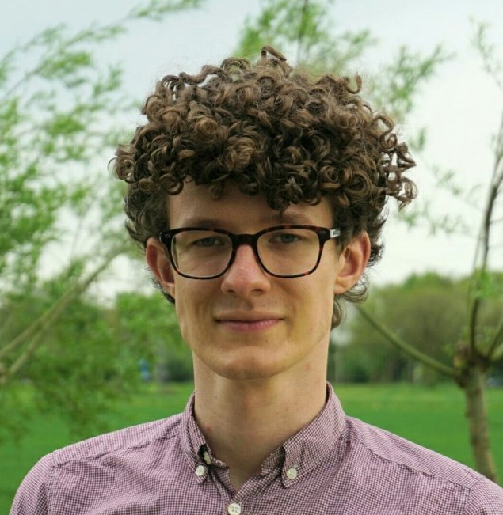
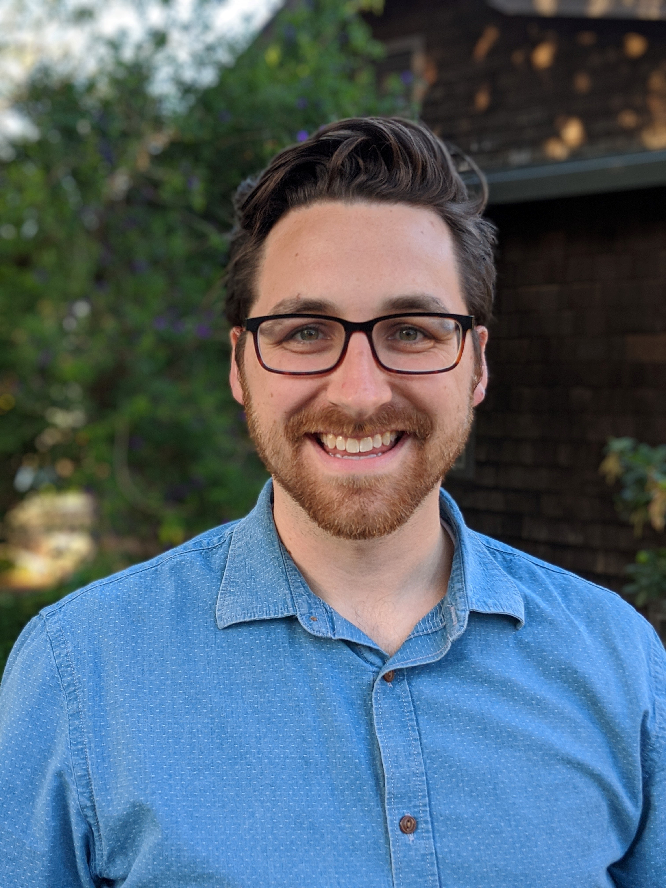

<!-- Banner -->
<!-- Note: The "styleN" class below should match that of the header element. -->
<section id="banner" class="style2">
	

		
			
		
		<header class="major">
			<h1>Speakers</h1>
		</header>
		

			
{{ page.description }}

		

	

</section>

<!-- Main -->

<!-- One -->
<section id="one">
	

		<header class="major">
        <h1 style="color:#ffffff;"> Keynote Speakers</h1>
		</header>
	

</section>

<!-- Two -->

<section id="two" class="spotlights">
	<section>
            
		

			

				<header class="major">
					<h3>Maria Jos&eacute; Aranzana</h3>
                    
				</header>
				
 
				Maria Jos&eacute; Aranzana is a researcher at the Research Institute of Agriculture, Food Research and Technology (IRTA) in Spain. After graduating in agronomy, she conducted a doctoral training in peach genetics and genomics at IRTA, and postdoctoral trainings at the University of Southern California (USA) and at the Centre of Research for Agricultural Genomics (CRAG) in Spain. Her area of research is in the field of Rosaceae genetics and genomics, including peach, Japanese plum, apple and pear. Her team is interested in different aspects of Rosaceae genome organization, variability and evolution that help to elucidate the genetics of important agricultural traits. Their aim is to apply this information to develop tools, as high quality markers for markers assisted selection (MAS) and genetic materials (including collections of introgression lines), to improve plant breeding efficiency.
				

			

		

	</section>
	
	<section>
            
		

			

				<header class="major">
					<h3>Ben Blackman</h3>
                    
				</header>
				

				Benjamin Blackman is an Associate Professor in the Department of Plant and Microbial Biology at the University of California at Berkeley. He received his B.S. in Biological Sciences from Stanford University in 2001 and then went on to complete his Ph.D. in Evolutionary Biology and Ecology at Indiana University, Bloomington in 2009. After several years as postdoctoral fellow at Duke University and a faculty appointment at the University of Virginia, he joined the Berkeley faculty in 2016. In 2017, he was honored with the Botanical Society of America’s Emerging Leader Award. Current research in the Blackman Lab explores the natural diversity of sunflowers and monkeyflowers to understand how plants respond to predictable seasonal and daily fluctuations in the environment and how these responses evolve during adaptation and domestication. 
				

			

		

	</section>

	<section>
			
		

			

				<header class="major">
					<h3>Caixia Gao</h3>
                    
				</header>
				
 
				Caixia Gao is Principal Investigator of the Institute of Genetics and Developmental Biology (IGDB), Chinese Academy of Sciences. Prior to joining IGDB in 2009, she served as Research Scientist of DLF’s biotechnology group in Denmark, where she worked in plant genetic transformation and molecular biology. Her current research area mainly focuses on developing a highly efficient and robust CRISPR platform in plant cells to enable targeted genome editing and the application of the resultant methods in improving plants traits for high-quality, disease resistance and stress tolerance in crop species.
				

			

		

	</section>

    <section>
            
        

            

                <header class="major">
                    <h3>Malia Gehan</h3>
                    
                </header>
                
 
			Malia Gehan, Ph.D. is an Assistant Member and Principal Investigator at the Donald Danforth Plant Science Center, who focuses on improving resistance to temperature stress. Most recently, she was a Research Scientist in the Mockler Lab (Danforth Center) and a NSF-PGRP Postdoctoral Fellow. During her Postdoctoral research she focused on developing tools for high-throughput phenotyping. Through work on phenotyping, she and colleagues started a Maker Group at the Danforth Center that focuses on developing low-cost phenotyping tools, and fun outreach events (Raspberry Jams!). Malia earned her Ph.D. in Plant Biology at Michigan State University Plant Research labs with Dr. Mike Thomashow examining natural variation in freezing tolerance and the integration of the circadian clock with cold signaling. As an undergraduate researcher in Biology at Willamette University she studied thermoinhibition of growth and development of guard cell protoplasts with Dr. J. Gary Tallman. Malia grew up in Kaneohe, Hawaii where there is very little change in temperature, which is probably why she is so interested in temperature signaling. In her free time she enjoys spending time with her husband (Jackson), daughter (Aiko) and sassy cat, Meowming.
                

            

        

    </section>

    <section>
            
        

            

                <header class="major">
                    <h3>Kaitlin Gold</h3>
                    
                </header>
                    
 
			Dr. Kaitlin (Katie) Gold is an Assistant Professor of Grape Pathology at Cornell University where she holds the primary research and extension responsibilities for grape disease management for New York state. Katie’s research combines plant pathology, machine learning, and remote sensing to study the fundamental and applied science of plant disease sensing to improve early disease detection and sustainable integrated management. Katie leads the Grape Sensing, Pathology, and Extension laboratory at Cornell AgriTech (GrapeSPEC). Katie completed her PhD in Plant Pathology and MS in Applied Statistics concurrently at the University of Wisconsin–Madison in 2019, where her dissertation research pioneered the use of hyperspectral imaging for pre-symptomatic disease and diagnosis. Prior to starting her tenure-track position at Cornell, she held a visiting faculty fellowship at the NASA Jet Propulsion Laboratory in Pasadena, CA with the Carbon and Ecosystem Cycling and Imaging Spectroscopy Groups to use AVIRIS-NG hyperspectral imagery for asymptomatic grape disease detection and mapping.
                    

            

        

    </section>
    
    
     <section>
            
        

            

                <header class="major">
                    <h3>Beth Sattely</h3>
                    
                </header>
                    
 
			Elizabeth S. Sattely is an American scientist and biotechnology engineer. Dr. Sattely is an Associate Professor of Chemical Engineering in the Department of Chemical Engineering, an HHMI investigator,and a ChEM-H Faculty Fellow at Stanford University. Inspired by human reliance on plants and plant-derived molecules for food and medicine, the Sattely laboratory is focused on the discovery and engineering of plant metabolic pathways to make molecules that can enhance human health. Dr. Sattely completed her graduate training at Boston College in organic chemistry with Amir Hoveyda and her postdoctoral studies in biochemistry at Harvard Medical School with Christopher T. Walsh, where she worked on natural product biosynthesis in bacteria
                    

            

        

    </section>
    
            

   
   <section>
            
        

            
             
                
. . .
                

            

        

   </section>    

</section>

<!-- Three -->
<section id="three" style="background-color:#c99700;>
	

		<header class="major">
        <h1 style="color:#ffffff;"> UC Davis Spotlight</h1>
		</header>
	

</section>

<!-- Four -->
<section id="four" class="spotlights">
	<section>
            
		

			

				<header class="major">
					<h3>Grey Monroe</h3>
                    
				</header>
				
 
					Grey is an evolutionary plant geneticist and Assistant Professor in the Department of Plant Sciences at UC Davis. He completed a Ph.D. of Ecology in 2019 at Colorado State University studying climate adaptation in both wild and domesticated plant species. He was then a post-doc at the Max Planck Institute for Developmental Biology where he investigated functional genome evolution and how mutation bias gives rise to beneficial genetic variation in plants. In 2020, he started The Genomics of Climate Adaptation lab at UC Davis. He loves being able to work with creative scientists everyday to develop a deeper understanding of evolutionary processes and address practical challenges confronting agriculture in the context of climate adaptation.
				

			

		

	</section>

	<section>
			
		

			

				<header class="major">
					<h3>Cameron Pittelkow</h3>
                    
				</header>
				
 
				Cameron joined the Department of Plant Sciences at UC Davis in 2019. He is an agronomist who places equal emphasis on food security and environmental sustainability. His research is focused on developing cropping systems and management strategies to enhance productivity while minimizing nitrogen, carbon, water, and energy footprints in agriculture. He received his BA in Environmental Biology from Colgate University, and his MS and PhD degrees from UC Davis in International Agricultural Development and Agronomy, respectively.
				

			

		

	</section>
    
     <section>
            
        

            
             
                
. . .
                

            

        

    </section>

<!-- Five -->
<section id="five" style="background-color:#c99700;>
	

		<header class="major">
        <h1 style="color:#ffffff;"> Flash talks</h1>
		</header>
	

</section>

<!-- Six -->
<!-- section id="six" class="spotlights">
	<section>
        	
		

			

				<header class="major">
					<h3>Jingwei Yu</h3>
                    
				</header>
				
 Jingwei Yu is a second-year master’s student in Horticulture and Agronomy, working with Dr. Diane Beckles in the Department of Plant Sciences. He is interested in starch biosynthesis in higher plants and improving crops by engineering starch-related traits. He received his BSc in Horticulture from Northwest A&F University in China.
				

			

		

	</section -->
	
	<!-- <section>
        	
		

			

				<header class="major">
					<h3>Stefan Petrasch</h3>
                    
				</header>
				
 Stefan Petrasch is a 4th year PhD student and works in the labs of Dr. Steve Knapp and Dr. Barbara Blanco-Ulate. He studies genetics of strawberry fruit quality, shelf life and fruit resistance to Botrytis cinerea via search for large effect loci and assessment of genomic prediction. Stefan previously obtained a BSc in Biology from TU Dresden in Germany and a MSc in Plant Science and Plant Breeding from Wageningen University in the Netherlands.
				

			

		

	</section> -->

	<!-- <section>
		
		

			

				<header class="major">
					<h3>Zachary Liechty</h3>
                    
				</header>
				
 Zach Liechty is a 5th year PhD student on the rice microbiome project in the Sundaresan Lab. He studies a variety of microbiome related topics including the effects of drought stress on microbial composition, the effects of nitrogen fertilizer on nitrogen cycling microbes, as well as rice cultivar variation in relation to methane emissions and methane cycling microbes. He previously a B.S. at Brigham Young University in Plant Genetics.
				

			

		

	</section> -->
    
</section>

