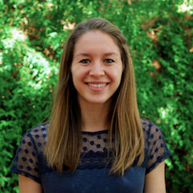
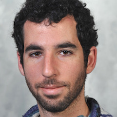

<!-- Banner -->
<!-- Note: The "styleN" class below should match that of the header element. -->
<section id="banner" class="style2">
	

		
			
		
		<header class="major">
			<h1>Speakers</h1>
		</header>
		

			
{{ page.description }}

		

	

</section>

<!-- Main -->

<!-- One -->
<section id="one">
	

		<header class="major">
        <h1 style="color:#ffffff;"> Keynote Speakers</h1>
		</header>
	

</section>

<!-- Two -->

<section id="two" class="spotlights">
	<section>
            
		

			

				<header class="major">
					<h3>Maria Jos&eacute; Aranzana</h3>
                    
				</header>
				
 
				Maria Jos&eacute; Aranzana is a researcher at the Research Institute of Agriculture, Food Research and Technology (IRTA) in Spain. After graduating in agronomy, she conducted a doctoral training in peach genetics and genomics at IRTA, and postdoctoral trainings at the University of Southern California (USA) and at the Centre of Research for Agricultural Genomics (CRAG) in Spain. Her area of research is in the field of Rosaceae genetics and genomics, including peach, Japanese plum, apple and pear. Her team is interested in different aspects of Rosaceae genome organization, variability and evolution that help to elucidate the genetics of important agricultural traits. Their aim is to apply this information to develop tools, as high quality markers for markers assisted selection (MAS) and genetic materials (including collections of introgression lines), to improve plant breeding efficiency.
				

			

		

	</section>
	
	<section>
            
		

			

				<header class="major">
					<h3>Ben Blackman</h3>
                    
				</header>
				

				Benjamin Blackman is an Associate Professor in the Department of Plant and Microbial Biology at the University of California at Berkeley. He received his B.S. in Biological Sciences from Stanford University in 2001 and then went on to complete his Ph.D. in Evolutionary Biology and Ecology at Indiana University, Bloomington in 2009. After several years as postdoctoral fellow at Duke University and a faculty appointment at the University of Virginia, he joined the Berkeley faculty in 2016. In 2017, he was honored with the Botanical Society of America’s Emerging Leader Award. Current research in the Blackman Lab explores the natural diversity of sunflowers and monkeyflowers to understand how plants respond to predictable seasonal and daily fluctuations in the environment and how these responses evolve during adaptation and domestication. 
				

			

		

	</section>
	
	<section>
            
		

			

				<header class="major">
					<h3>Rob Cicchillo</h3>
                    
				</header>
				

				During his career at Corteva Agriscience, Rob has spent significant time on both the Crop Protection and Seeds/Traits platforms. Rob is the External Collaborations Leader within Corteva Agriscience’s crop protection R&D organization. He partners with the crop protection leadership team and technology/acquisition and licensing to drive business value through strategic external collaboration investment in critical capabilities. Additionally, Rob co-leads Corteva’s Natural Products platform where the team is applying advanced integrated  ‘omics approaches to regularize Natural products discovery and optimization. Rob obtained a Ph.D. from Penn State University in Biochemistry and Molecular Biology where he worked on elucidating novel enzymatic transformations catalyzed by Radical SAM proteins (Professor Squire J. Booker).   He subsequentlyheld a postdoctoral appointment in the laboratory of Professor Wilfred A. van der Donk (University of Illinois at Urbana-Champaign) where he helped determine biosynthetic pathways of phosphonate natural products.
				

			

		

	</section>

	<section>
			
		

			

				<header class="major">
					<h3>Caixia Gao</h3>
                    
				</header>
				
 
				Caixia Gao is Principal Investigator of the Institute of Genetics and Developmental Biology (IGDB), Chinese Academy of Sciences. Prior to joining IGDB in 2009, she served as Research Scientist of DLF’s biotechnology group in Denmark, where she worked in plant genetic transformation and molecular biology. Her current research area mainly focuses on developing a highly efficient and robust CRISPR platform in plant cells to enable targeted genome editing and the application of the resultant methods in improving plants traits for high-quality, disease resistance and stress tolerance in crop species.
				

			

		

	</section>

    <section>
            
        

            

                <header class="major">
                    <h3>Malia Gehan</h3>
                    
                </header>
                
 Malia Gehan did undergraduate research on heat stress and thermotolerance in tobacco at Willamette University and she did her Ph.D. research examining the intersection of cold signaling and the circadian at Michigan State University. She was a NSF Plant Genome Postdoctoral Fellow and is currently an Assistant Member and Principal Investigator at the Donald Danforth Plant Science Center, whose group focuses understanding mechanisms of crop resilience under temperature stress. To study temperature stress and natural variation, the Gehan lab develops high-throughput and high-resolution image-based phenotyping technologies, including low-cost solutions that use Raspberry Pi computers. The Gehan Lab co-develops and maintain the open-source open-development suite of image analysis tools, PlantCV (https://plantcv.danforthcenter.org/), along with Dr. Noah Fahlgren’s group. Dr. Gehan was part of the steering committee that helped to form the North American Plant Phenotyping Network and was elected to the board in 2020. Dr. Gehan is interested in increasing communication and connections across phenomics-related disciplines and organizations; using plant phenotyping as away of increasing student interest in plant science and skills in data science; and democratizing plant phenotyping using open-source hardware and software.
                

            

        

    </section>

    <section>
            
        

            

                <header class="major">
                    <h3>Kaitlin Gold</h3>
                    
                </header>
                    
 
			Dr. Kaitlin (Katie) Gold is an Assistant Professor of Grape Pathology at Cornell University where she holds the primary research and extension responsibilities for grape disease management for New York state. Katie’s research combines plant pathology, machine learning, and remote sensing to study the fundamental and applied science of plant disease sensing to improve early disease detection and sustainable integrated management. Katie leads the Grape Sensing, Pathology, and Extension laboratory at Cornell AgriTech (GrapeSPEC). Katie completed her PhD in Plant Pathology and MS in Applied Statistics concurrently at the University of Wisconsin–Madison in 2019, where her dissertation research pioneered the use of hyperspectral imaging for pre-symptomatic disease and diagnosis. Prior to starting her tenure-track position at Cornell, she held a visiting faculty fellowship at the NASA Jet Propulsion Laboratory in Pasadena, CA with the Carbon and Ecosystem Cycling and Imaging Spectroscopy Groups to use AVIRIS-NG hyperspectral imagery for asymptomatic grape disease detection and mapping.
                    

            

        

    </section>
    
    
     <section>
            
        

            

                <header class="major">
                    <h3>Beth Sattely</h3>
                    
                </header>
                    
 
			Elizabeth S. Sattely is an American scientist and biotechnology engineer. Dr. Sattely is an Associate Professor of Chemical Engineering in the Department of Chemical Engineering, an HHMI investigator,and a ChEM-H Faculty Fellow at Stanford University. Inspired by human reliance on plants and plant-derived molecules for food and medicine, the Sattely laboratory is focused on the discovery and engineering of plant metabolic pathways to make molecules that can enhance human health. Dr. Sattely completed her graduate training at Boston College in organic chemistry with Amir Hoveyda and her postdoctoral studies in biochemistry at Harvard Medical School with Christopher T. Walsh, where she worked on natural product biosynthesis in bacteria
                    

            

        

    </section>
    
            

   
   <section>
            
        

            
             
                
. . .
                

            

        

   </section>    

</section>

<!-- Three -->
<section id="three" style="background-color:#c99700;>
	

		<header class="major">
        <h1 style="color:#ffffff;"> UC Davis Spotlight</h1>
		</header>
	

</section>

<!-- Four -->
<section id="four" class="spotlights">
	<section>
            
		

			

				<header class="major">
					<h3>Grey Monroe</h3>
                    
				</header>
				
 
					Grey is an evolutionary plant geneticist and Assistant Professor in the Department of Plant Sciences at UC Davis. He completed a Ph.D. of Ecology in 2019 at Colorado State University studying climate adaptation in both wild and domesticated plant species. He was then a post-doc at the Max Planck Institute for Developmental Biology where he investigated functional genome evolution and how mutation bias gives rise to beneficial genetic variation in plants. In 2020, he started The Genomics of Climate Adaptation lab at UC Davis. He loves being able to work with creative scientists everyday to develop a deeper understanding of evolutionary processes and address practical challenges confronting agriculture in the context of climate adaptation.
				

			

		

	</section>

	<section>
			
		

			

				<header class="major">
					<h3>Cameron Pittelkow</h3>
                    
				</header>
				
 
				Cameron joined the Department of Plant Sciences at UC Davis in 2019. He is an agronomist who places equal emphasis on food security and environmental sustainability. His research is focused on developing cropping systems and management strategies to enhance productivity while minimizing nitrogen, carbon, water, and energy footprints in agriculture. He received his BA in Environmental Biology from Colgate University, and his MS and PhD degrees from UC Davis in International Agricultural Development and Agronomy, respectively.
				

			

		

	</section>
    
     <section>
            
        

            
             
                
. . .
                

            

        

    </section>

<!-- Five -->
<section id="five" style="background-color:#c99700;>
	

		<header class="major">
        <h1 style="color:#ffffff;"> Flash talks</h1>
		</header>
	

</section>

<!-- Six -->
<section id="six" class="spotlights">
	<section>
        	
		

			

				<header class="major">
					<h3>Jaclyn Adaskaveg</h3>
			
				</header>
				
 Jaclyn Adaskaveg is a fourth year PhD candidate in the Plant Biology Graduate Group at UC Davis and is a member of Dr. Barbara Blanco-Ulate's Lab. She received her B.S in Genetics and Genomics from UC Davis in 2017. Her research integrates molecular biology, bioinformatics, and fruit physiology to better understand the relationship between the genetic regulation of fruit ripening and fruit quality. Her focus has been on tomato ripening and is now exploring pistachio development and hull ripening.
				

			

		

	</section>
	
	<section>
        	
		

			

				<header class="major">
					<h3>Celine Caseys</h3>
                    
				</header>
				
 Celine Caseys is an assistant project scientist at the UC Davis Department of Plant Sciences. She grew in the suburban area of Geneva (Switzerland) on a farm, making plants an essential part of her universe for as long as she can remember. She completed both her Bachelor's and Master's degrees at the University of Geneva with an early focus on phytochemistry and plant interactions. She earned her Ph.D. at the University of Fribourg (Switzerland), studying phytochemical defenses in hybridizing poplar trees. She was then awarded a postdoctoral fellowship to study the consequences of hybridization in Sunflower with Loren Rieseberg at the University of British Columbia, in Canada. Since 2016, she is a student of the Botrytis interactions in the lab of Dan Kliebenstein.
				

			

		

	</section>
	
	<section>
        	
		

			

				<header class="major">
					<h3>Min-Yao Jhu</h3>
                    
				</header>
				
 Min-Yao Jhu is a sixth-year Ph.D. candidate in the Plant Biology Graduate Program at the University of California, Davis. She received her B.S. in Life Sciences at National Cheng Kung University in Taiwan, and her M.S. in Plant Biology at National Taiwan University. In 2018, she was the recipient of the Elsie Taylor Stocking Memorial Fellowship. In 2020, she was honored with Loomis Robert S. and Lois Ann Graduate Award in Agronomy. Min-Yao is currently working with Professor Neelima Sinha and is focusing on stem parasitic plant research. Her research combines bioinformatics, genetics, molecular biology, and histology methods to study haustorium development and the interaction between parasitic plants and host plants. Besides her academic works, she enjoys ballroom dancing, drawing, and painting.
				

			

		

	</section>
	
	<section>
        	
		

			

				<header class="major">
					<h3>Zohar Meir</h3>
		   
				</header>
				
 Zohar Meir did his MSc. under the supervision of Amos Tanay, Faculty in the department of Math & Computer Sciences at the Weizmann Institute of Sciences - where he studied epigenetic memory in cancer cells by analyzing single-cell DNA-methylation and single-cell RNA profiles. During his Ph.D he switched to work on mechanisms of plasticity and commitment in his favorite organisms – plants, together with the group of Yuval Eshed from the department of Plants in Weizmann.
				

			

		

	</section>
	
	<section>
        	
		

			

				<header class="major">
					<h3>Jaime Corbiniano dos Santos Neto</h3>
				</header>
				
 Jaime Corbiniano dos Santos Neto lives in Cabo de Santo Agostinho, Pernambuco and is an undergraduate in the Agronomy course at the Federal Rural University of Pernambuco. Jaime is a member of a research group that focuses on nematodes and their impact on several important agricultural crops.
				

			

		

	</section>
    
</section>

