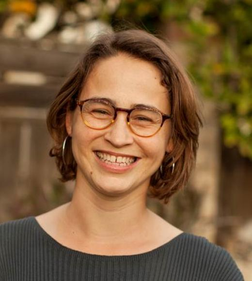

<!-- Banner -->
<!-- Note: The "styleN" class below should match that of the header element. -->
<section id="banner" class="style2">
	

		
			
		
		<header class="major">
			<h1>Speakers</h1>
		</header>
		

			
{{ page.description }}

		

	

</section>

<!-- Main -->

<!-- One -->
<section id="one">
	

		<header class="major">
        <h1 style="color:#ffffff;"> Keynote Speakers</h1>
		</header>
	

</section>

<!-- Two -->

<section id="two" class="spotlights">
	<section>
            
		

			

				<header class="major">
					<h3>CJ Schwartz</h3>
                    
				</header>
				
 
				CJ Schwartz received his BS degree in Genetics from the University of Minnesota, a Ph.D. in Biochemistry at the University of Wisconsin, and a postdoc at the Salk Institute in San Diego with Joanne Chory and Detlef Weigel focusing on natural variation of light responsiveness. After nearly 20 years in academia, CJ founded a company 5 years ago (Sunrise Genetics), which applies modern molecular genetic techniques for gene discovery and marker assisted selection (MAS) breeding in Cannabis. In collaboration with the University of Minnesota and the J. Craig Venter Institute, Sunrise Genetics was the first to make public a high-quality Cannabis genome assembly, which is recognized as the Cannabis genomic reference accession by NCBI.
				

			

		

	</section>

	<section>
			
		

			

				<header class="major">
					<h3>Esther van der Knaap</h3>
                    
				</header>
				
 
				Esther van der Knaap received her BS/MS in Plant Pathology from Wageningen University in
the Netherlands and her Ph.D. in Genetics from the Plant Research Laboratory at Michigan State University. Her post-doctoral training in Plant Breeding at Cornell University. She is now a  professor at the University of Georgia, Athens, in the department of Horticulture as well as in the Institute of Plant Breeding, Genetics and Genomics. She is an adjunct professor in Genetics and Plant Biology at UGA. The research in her lab focuses on the genetic, molecular and cellular bases of tomato fruit morphology including the characterization and quantification of fruit shapes and sizes.
				

			

		

	</section>

    <section>
            
        

            

                <header class="major">
                    <h3>Irwin Goldman</h3>
                    
                </header>
                
 
			Irwin Goldman has been a professor at University of Wisconsin-Madison since 1992. Dr. Goldman’s graduate work was done at North Carolina State University and at the University of Wisconsin-Madison. He then moved on to the University of Illinois to do his postdoctoral work. Current work in Dr. Goldman’s research group focuses on breeding in carrot, onion, and table beet. Dr. Goldman’s breeding expertise extends into his teaching, where he teaches courses such as World Vegetable Crops, Plant Breeding, Plants and Human Wellbeing, Evolutionary Biology, and Food and Seed Sovereignty.
                

            

        

    </section>

    <section>
            
        

            

                <header class="major">
                    <h3>Julie Dawson</h3>
                    
                </header>
                    
 
			Julie Dawson is an Associate Professor in the Department of Horticulture at the University of Wisconsin-Madison. Her background is in organic plant breeding and participatory research. Research topics include season extension methods, organic and participatory variety trials and variety selection for small-acreage farms and gardens as well as extension resources for urban growers. She leads a project called the Seed to Kitchen Collaborative with other plant breeders to test varieties with local farmers and chefs, focused on flavor for local food systems.
                    

            

        

    </section>
    
    
     <section>
            
        

            

                <header class="major">
                    <h3>Luis Cisneros-Zevallos</h3>
                    
                </header>
                    
 
			Dr. Luis Cisneros is a Food Engineer from the National Agrarian University – La Molina, Peru. He received his M.S. and Ph.D. degree in Food Science from the University of California at Davis. He is currently a Professor at Texas A&M University in the Department of Horticultural Sciences, and is also associated with the Nutrition and Food Science Department and the Molecular and Environmental Plant Science Program. He leads the Plant Bioactives & Bioprocessing Research Lab carrying out: Drug discovery of bioactive compounds from plants and their mode of action, Research activities on pre- and postharvest horticultural crops with emphasis on the biosynthesis of secondary metabolites in plants under various stresses, Research on the interaction between microorganisms and plant surfaces to understand contamination, create innovative disinfection processes, and develop novel nanotechnology techniques.
                    

            

        

    </section>
    
    

</section>

<!-- Three -->
<section id="three" style="background-color:#c99700;>
	

		<header class="major">
        <h1 style="color:#ffffff;"> UC Davis Spotlight</h1>
		</header>
	

</section>

<!-- Four -->
<section id="four" class="spotlights">
	<section>
            
		

			

				<header class="major">
					<h3>Brian Bailey</h3>
                    
				</header>
				
 
					Brian Bailey started as an assistant professor in the UC Davis Plant Sciences Department in 2016. His research combines engineering, computer science, atmospheric science, and biology to study plant systems. In particular, Brian's lab is developing high-resolution, 3D models and measurement techniques that can explicitly represent plant-environment interactions at scales ranging from leaves to canopies. Recent work in the Bailey lab has focused on developing models for woody perennial crops such as almond and grapevine. Brian received his MS and PhD degrees in mechanical engineering from the University of Utah.
				

			

		

	</section>

	<section>
			
		

			

				<header class="major">
					<h3>Beth Forrestel</h3>
                    
				</header>
				
 
				Dr. Elisabeth Forrestel started as an Assistant Professor at UC Davis in Viticulture and Enology in fall 2019. She received her bachelor's degree in biology from Cornell University and her PhD in Ecology & Evolutionary biology from Yale University. Dr. Forrestel went on to complete postdoctoral work at the Arnold Arboretum of Harvard University studying the phenological responses of winegrapes to a warming climate. As an NSF Postdoctoral Fellow, she came to UC Davis to study the phylogenetic and functional basis of abiotic stress responses in wild and cultivated grapevine. Her research program at Davis addresses questions about the evolutionary and ecophysiological basis of drought and heat responses in grapevine, and how irrigation practices mitigate stress responses. Dr. Forrestel will apply her research to improve understanding of how we can utilize wild species and cultivar diversity to adapt to warmer and drier climates, and inform viable management practices in vineyards in response to heat stress.
				

			

		

	</section>

	<section>
			
		

			

				<header class="major">
					<h3>Christine Diepenbrock</h3>
                    
				</header>
				
 
				Christine Diepenbrock is an assistant professor in Plant Sciences at UC Davis, focused on understanding and improving crop nutritional quality and abiotic stress tolerance in staple and specialty crops. So far, she and her group have focused on dissecting the genetic basis of nutritional quality traits and integrating crop physiology and genomics. Christine obtained a Ph.D. in Plant Breeding and Genetics at Cornell University and a Bachelor’s degree in Biology: Molecular Biology and Biochemistry from Washington University in St. Louis.
				

			

		

	</section>

    <section>
            
        

            

                <header class="major">
                    <h3>Troy Magney</h3>
                    
                </header>
                

		Troy is an Assistant Professor this year in the Department of Plant Sciences. He was most recently a research scientist in the Carbon Cycle and Ecosystems group at the NASA Jet Propulsion Laboratory in Pasadena, CA. His research tries to ‘see’ the things that feed our families, clean our air, and nourish our ecosystems a little differently. His lab group distills images of fields and forests into a kaleidoscope of colors to inform our understanding of plant health, productivity, and stress.
                

            

        

    </section>
    
     <section>
            
        

            
             
                
. . .
                

            

        

    </section>

<!-- Five -->
<section id="five" style="background-color:#c99700;>
	

		<header class="major">
        <h1 style="color:#ffffff;"> Flash talk</h1>
		</header>
	

</section>

<!-- Six -->
<section id="six" class="spotlights">
	<section>
        	
		

			

				<header class="major">
					<h3>Jingwei Yu</h3>
                    
				</header>
				
 Jingwei Yu is a second-year master’s student in Horticulture and Agronomy, working with Dr. Diane Beckles in the Department of Plant Sciences. He is interested in starch biosynthesis in higher plants and improving crops by engineering starch-related traits. He received his BSc in Horticulture from Northwest A&F University in China.
				

			

		

	</section>

	<section>
		
		

			

				<header class="major">
					<h3>Zachary Liechty</h3>
                    
				</header>
				
 Zach Liechty is a 5th year PhD student on the rice microbiome project in the Sundaresan Lab. He studies a variety of microbiome related topics including the effects of drought stress on microbial composition, the effects of nitrogen fertilizer on nitrogen cycling microbes, as well as rice cultivar variation in relation to methane emissions and methane cycling microbes. He previously a B.S. at Brigham Young University in Plant Genetics.
				

			

		

	</section>
    
</section>

